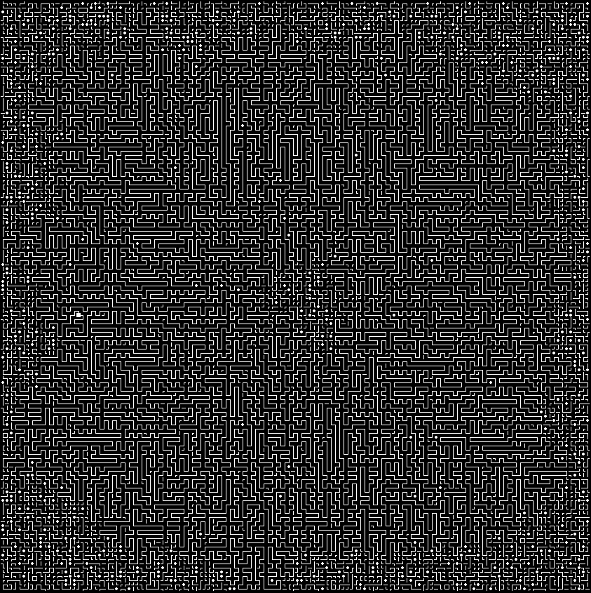
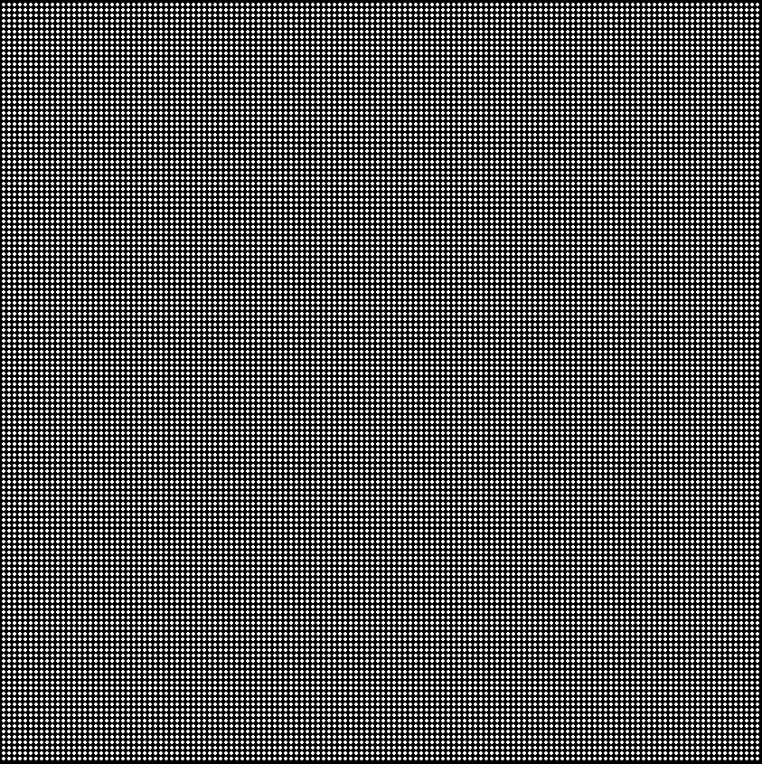

##### Aller au jour : [1](Jour%201) [2](Jour%202) [3](Jour%203) [4](Jour%204) [5](Jour%205) [6](Jour%206) [7](Jour%207) [8](Jour%208) [9](Jour%209) 10 [11](Jour%2011) [12](Jour%2012) [13](Jour%2013) [14](Jour%2014) [15](Jour%2015) [16](Jour%2016) [17](Jour%2017) [18](Jour%2018) [19](Jour%2019) [20](Jour%2020) [21](Jour%2021) [22](Jour%2022) [23](Jour%2023) [24](Jour%2024) [25](Jour%2025) 

# Jour 10

## Partie 1

J'utilise le delta-plane pour atteindre une île de métal.

Me voici face à une matrice de tuyaux de 140x140 cellules dans laquelle se trouve un animal (indiqué par `S`).

```no_run
..F7.
.FJ|.
SJ.L7
|F--J
LJ...
```

Les différentes lettres (autres que `S`) représentent les formes de tuyaux. Si je remplace les lettres par des symboles plus précis ça donne ça :

```no_run
  ┌┐
 ┌┘│
S┘ └┐
│┌──┘
└┘
```

L'animal part de `S` et se promène à travers les tuyaux. La question posée est : quel est le nombre de pas dans les tuyaux qu'il doit faire pour atteindre la cellule la plus éloignée (en nombre de pas dans le tuyau) de son point de départ ?

Dans cet exemple, ce serait la cellule que j'ai marquée d'un `E` : elle est atteignable en `8` pas.

```no_run
  ┌┐
 ┌┘│
S┘ └E
│┌──┘
└┘
```

L'énoncé suggère une approche à base de remplissage : chaque cellule connectée au `S` initial est à distance `1` ; puis chaque cellule connectée à un `1` est à distance `2`, etc.

Voici à quoi pourrait ressembler la grille pendant l'exécution d'un tel algorithme.

```no_run
  ┌┐
 23│
01 └E
1┌──┘
23
```

Une approche alternative à laquelle je pense serait de partir de `S` en se déplaçant dans les tuyaux (peu importe dans quelle direction), et le nombre de pas effectué pour revenir à `S` serait nécessairement le double de la distance maximale. Remarquer que ce nombre de pas serait nécessairement pair.

Il n'y aurait pas de difficulté particulière à implémenter ce parcours, vu que le chemin ne comporte pas de bifurcations.

Je décide de tenter cette approche.

Mais d'abord, je m'amuse à remplacer les lettres par de jolis caractères dans toute l'entrée, je prends une police qui va bien, une copie d'écran de mon terminal, et un coup de remplissage dans un éditeur d'images :


C'est joli mais ça ne me donne pas la longueur de la boucle. Il y aurait probablement quelque chose à tenter en analysant cette image, mais je pense que ce sera plus simple de partir du texte.

Je dois choisir une représentation pour la grille de tuyaux. Le plus important est de pouvoir déterminer si deux cellules sont connectées. Je pourrais remplacer chaque lettre par un masque comme par exemple `[ 1 0 0 1 ]` pour un `J` : passage possible en haut, et à droite (en énumérant les directions dans le sens des aiguilles d'une montre).

Alternativement chaque cellule pourrait contenir une liste des mouvements possibles : pour un `J` ce serait donc la paire `[ [ 0 -1 ] [ -1 0 ] ]`.

Je me dis que je peux stocker la matrice telle quelle puis convertir en directions à la volée.

Du coup, la lecture de l'entrée est triviale :

```
Parse ← ⊜∘ ≠@\n.

$ ..F7.
$ .FJ|.
$ SJ.L7
$ |F--J
$ LJ...
Parse
```

Pour trouver les coordonnées du `S`, je tente d'abord `indexof` mais ça ne fait pas ce que je veux (il me donne la position du `S` dans chaque ligne). Je me replie sur un `equals` suivi d'un `where` (qui génère bien des indices à 2 dimensions dans ce cas), et enfin `first` pare que je ne veux que le premier résultat :

```
FindStart ← ⊢⊚=@S

["..F7."
 ".FJ|."
 "SJ.L7"
 "|F--J"
 "LJ..."]
FindStart
```

Une petite difficulté, c'est que le `S` masque la forme de tuyau de la case de départ. Comme le suggère l'énoncé, on peut la déduire des tuyaux environnants.

Les cellules connectées au `S` sont celles qui ont le `S` dans leurs voisines accessibles.

Je commence par une fonction pour résoudre les caractères en une liste de directions :

```
Directions ← (
  ⊗ :"SJLF7|-"
  {[0_¯1 1_0 0_1 ¯1_0] # S
   [0_¯1 ¯1_0]         # J
   [¯1_0 0_1]          # L
   [0_1 1_0]           # F
   [1_0 0_¯1]          # 7
   [¯1_0 1_0]          # |
   [0_1 0_¯1]          # -
   ↯ 0_2 []}           # .
  °□ ⊡:
)

Directions @J
```

J'ai indiqué toutes les directions possibles pour le `S` mais bien sûr c'est à raffiner.

Ensuite j'écris une fonction `Neighbors` qui va énumérer les voisins accessibles d'une cellule.

J'ai besoin de créer `TryPick` qui va chercher dans la matrice aux coordonnées demandées, mais renvoie `.` pour les cellules de coordonnées négatives (car `pick` interprète les indices négatifs comme devant chercher à partir de la fin du tableau, ce qui ne m'arrange pas).

```
Directions ← (
  ⊗ :"SJLF7|-"
  {[0_¯1 1_0 0_1 ¯1_0] # S
   [0_¯1 ¯1_0]         # J
   [¯1_0 0_1]          # L
   [0_1 1_0]           # F
   [1_0 0_¯1]          # 7
   [¯1_0 1_0]          # |
   [0_1 0_¯1]          # -
   ↯ 0_2 []}           # .
  °□ ⊡:
)

TryPick ← (
  .
  ≥ 0_0
  /↧
  (⋅⋅@.|⊡)
)

Neighbors ← (
  ⊙TryPick.
  ⊙Directions
  ¤
  +
)

["..F7."
 ".FJ|."
 "SJ.L7"
 "|F--J"
 "LJ..."]
2_0
Neighbors
```

Le reste de l'implémentation se déroule un peu laborieusement. Je mets tout le programme résultant ci-dessous, avec quelques commentaires.

```
Parse ← ⊜∘ ≠@\n.
FindStart ← ⊢⊚=@S
Directions ← (
  ⊗ :"SJLF7|-"
  {[0_¯1 1_0 0_1 ¯1_0] # S
   [0_¯1 ¯1_0]         # J
   [¯1_0 0_1]          # L
   [0_1 1_0]           # F
   [1_0 0_¯1]          # 7
   [¯1_0 1_0]          # |
   [0_1 0_¯1]          # -
   ↯ 0_2 []}           # .
  °□ ⊡:
)

TryPick ← (
  .
  ≥ 0_0
  /↧
  (⋅⋅@.|⊡)
)

Neighbors ← (
  ⊙TryPick.
  ⊙Directions
  ¤
  +
)

# FirstStep reçoit la coordonnée de S et la matrice, et renvoie
# les coordonnées d'une des deux cases accessibles depuis S
FirstStep ← (
  # on commence par énumérer les voisins de S
  ⊃(
    Neighbors
  | ⊙∘ # on conserve la matrice
  )
  # puis on énumère les voisins de chacun de ceux-ci
  ⊃(
    ⊙(¤;)
    ≡(□Neighbors)
  | ⊙∘ # on conserve les voisins et la position de S
  )
  # on a maintenant une liste de listes de voisins en boîte
  # on cherche quels "voisins" de S ont S comme voisin
  ⊙(¤:)
  ≡(∊: °□)
  ▽
  # et on prend le premier
  ⊢
)

# FindNext reçoit la position courante, la position précédente
# et la matrice, et renvoie la nouvelle position
FindNext ← (
  # on cherche les voisins de la position courante
  ⊃(
    ⊙;
    Neighbors
  | ⋅∘ # on conserve la position précédente
  )
  # on cherche les voisins qui différent de la position précédente
  ⊃(
    ⊙¤  # fixer la position précédente
    ¬≡≍ # comparer chaque voisin à celle-ci
  | ∘   # on conserve la liste des voisins
  )
  ▽ # on filtre la liste des voisins
  ⊢ # on renvoie le premier
)

# Step prend la position courante, la position précédente et
# la matrice. Elle renvoie la nouvelle position, l'ancienne position
# et la matrice.
Step ← ⊃(
  FindNext
| ⊙⋅∘ # on conserve l'ancienne position courante et la matrice
)

# HasArrived prend la position courante, la position précédente et
# la matrice. Elle renvoie 1 si la position courante est sur `S`.
HasArrived ← (
  ⊙⋅∘ # on enlève la position précédente
  TryPick
  =@S
)

# WalkLoop prend la position d'un voisin de `S`,
# la position de `S` et la matrice. C'est-à-dire l'état
# de la pile après le premier pas.
# Elle parcourt la boucle et renvoie le nombre de pas nécessaire
# pour arriver à `S`.
WalkLoop ← (
  1 # on initialise le compteur de pas à 1
  # (le premier pas a déjà été fait)
  ⍢(
    +1             # on incrémente le compteur
    ⊙Step          # on fait un pas
  ) (¬⋅HasArrived) # tant qu'on est pas arrivé
  ⊙⋅⋅;             # on ne conserve que le compteur final
)

PartOne ← (
  Parse
  # on trouve la position de S
  FindStart.
  ⊃(
    # on trouve un voisin de S
    FirstStep
  | ⊙∘ # on conserve la position de S et la matrice
  )
  # on a maintenant la position du premier voisin de S,
  # la position de S et la matrice, on peut donc appeler WalkLoop
  WalkLoop
  # plus qu'à diviser par 2 pour connaître la distance maximum
  ÷2
)

$ ..F7.
$ .FJ|.
$ SJ.L7
$ |F--J
$ LJ...
⍤⊃⋅∘≍ 8 PartOne
```

Je ne suis pas très content de mon implémentation, j'ai l'impression d'avoir plus tâtonné que nécessaire. Mais bon, j'ai la réponse, c'est l'essentiel.

## Partie 2

On me demande maintenant combien de cellules sont enfermées par la boucle.

Si je reprends ma visualisation précédente, je peux faire un _flood fill_ pour voir quelles zones sont concernées :


Attention, sur l'image on a l'impression qu'il y a beaucoup de cases remplies, mais la plupart de cette coloration concerne des espaces entre les tuyaux, qui ne sont pas à prendre en compte pour la solution.

Je crois que je vois comment faire : d'abord, identifier les cellules de la boucle, bien sûr.

Puis je devrais pouvoir parcourir la matrice ligne à ligne, en alternant entre l'extérieur et l'intérieur à chaque fois que je croise la boucle.

Il y a quand même une subtilité à gérer, c'est le cas où la boucle se déplace horizontalement.

En fait, je ne peux pas me contenter de regarder si les cellules font partie de la boucle ou non. Par exemple, une séquence constituée de 5 cellules de boucle peut ressembler à ceci, où la zone à gauche et la zone à droite sont dans différentes régions :

```no_run
...┌───┘...
```

Ou à ceci, où les deux zones appartiennent à la même région :

```no_run
...┌───┐...
```

Ça peut même être plus compliqué :


```no_run
...┌─┘┌┐...
```

Là, on a deux changements de région donc la gauche et la droite appartiennent à la même région.

Je sens que je m'y prends un peu n'importe comment, mais j'essaie d'avancer quand même.

Je pourrais détecter les séquences de la forme `┌───┐` ou `└───┘` et les supprimer simplement, puisqu'elles ne représentent pas de changement de région.

Quant aux séquences `└───┐` ou `┌───┘`, je peux les remplacer par un simple `|`. Ainsi, le dernier exemple ci-dessus deviendrait :

```no_run
...|...
```

Et je pourrais me ramener à mon idée initiale de compter les cellules entre deux `|`.

Est-ce que je ne pourrais pas faire tout ça avec `regex`, finalement ?

Commençons par isoler les cellules de boucle. Je devrais pouvoir le faire avec une variante de `WalkLoop` : au lieu de maintenir un compteur, je vais collecter les cellules visitées.

Je crée `CollectLoop` qui fait ça.

```no_run
CollectLoop ← (
  ¤, # initier la liste avec le nœud de départ
  ⍢(
    ⊃(
      ⊂     # ajouter le nœud en cours à la liste
    | ⋅Step # chercher le nœud suivant
    )
  ) (¬⋅HasArrived)
  ⊙⋅⋅;
)
```

Là je peux utiliser une fonction très pratique de Uiua qui est `un``where` (l'inverse de `where`). Cette fonction prend une liste d'indices (qui peuvent être à plusieurs dimensions comme ici), et construit une matrice binaire contenant `1` aux emplacements désignés par les différentes coordonnées.

Par exemple :

```
[2_0
 3_0
 4_0
 4_1
 3_1
 3_2
 3_3
 3_4
 2_4
 2_3
 1_3
 0_3
 0_2
 1_2
 1_1
 2_1]
°⊚
```

Je vais utiliser cette matrice binaire pour filtrer la matrice d'origine. Attention à bien redimensionner la matrice de caractères à la dimension de la matrice binaire, au cas où la boucle ne toucherait pas tous les bords (ma visualisation me montre qu'elle touche bien les bords dans mon entrée, mais bon).

```
["X.F7.XX"
 ".FJ|.XX"
 "SJXL7XX"
 "|F--JXX"
 "LJ..XXX"
 "XXXXXXX"]

[0_0_1_1_0_0
 0_1_1_1_0_0
 1_1_0_1_1_0
 1_1_1_1_1_0
 1_1_0_0_0_0]

Crop ← (
  °⊟△    # récupérer la taille de la première matrice
  ⊙(≡↙¤) # tronquer chaque ligne de la deuxième
  ↙      # enlever les lignes en trop
)

⊃(∘|Crop) # tronquer la matrice de caractères à la même taille
(@.|∘)    # remplacer les caractères hors boucle par `.`
```

Me voici donc avec une matrice ne contenant des caractères "tuyaux" que sur les cellules de la boucle.

Ah zut, je n'ai pas géré le `S`. Quelle plaie !

Si je prends le premier, le deuxième et le dernier élément de la boucle, je devrais pouvoir en déduire la forme sous le `S`.

```
Letters ← "SJLF7|-."
Directions ← (
  {[0_¯1 1_0 0_1 ¯1_0] # S
   [0_¯1 ¯1_0]         # J
   [¯1_0 0_1]          # L
   [0_1 1_0]           # F
   [1_0 0_¯1]          # 7
   [¯1_0 1_0]          # |
   [0_1 0_¯1]          # -
   ↯ 0_2 []}           # .
)
LetterFromDirections ← (
  Directions
  :
  ⊃(
    ⊗□  # on cherche la paire dans la table
  | ⊗□⇌ # et aussi la paire inversée
  )
  ↧         # on prend le meilleur résultat
  ⊡:Letters # on retrouve la lettre correspondante
)
GetStartDirections ← (
  ⊃(⊢|⊡1|⊢⇌) # on extrait première, deuxième et dernière position
  ⊃(-:|-:⊙;) # on soustrait la position de départ des autres
  ⊟          # on forme la paire de directions
)

[2_1 1_1 1_2 0_2 0_3 1_3 2_3 2_4 3_4 3_3 3_2 3_1 4_1 4_0 3_0 2_0]
GetStartDirections
LetterFromDirections
```

Voilà, avec ça je devrais pouvoir remplacer le `S` par une forme correcte.

Reste à appliquer les bonnes règles sur la matrice résultante.

Je vois comment faire avec des remplacements par expression régulière, mais je n'ai pas de fonction toute faite en Uiua pour faire un remplacement.

Est-ce que je peux trouver une façon de faire sans `regex` ?

Au lieu de faire le remplacement de `└───┐` ou `┌───┘` par `│`, et la suppression de `┌───┐` ou `└───┘`, je pourrais considérer `┌` et `┐` comme `│` (changement de région), et `┘` et `└` comme `─`, c'est-à-dire les ignorer. En effet, cela revient à n'observer que la partie basse de ces caractères, et j'ai l'impression que ça devrait marcher.

```
CountInside ← (
  ∧(
    # sur la pile : une lettre, la région en cours, le compteur
    (
      (
        # rien à faire : on garde la région et le compteur
        ⊙∘
        | # une cellule vide : garder la région, incrémenter le compteur
        ⊙+.
      )=@.
    | # changement de région
      ⊓;¬
    ) ∊:"F7|".
  ) ⊙(0 0) # accumulateurs: région en cours (1=dedans), compteur
  # vérification : en fin de ligne on doit être dehors
  ⍤"should end outside"=0
)

⍤⊃⋅∘≍ 0 CountInside "....."
⍤⊃⋅∘≍ 1 CountInside ".|.|."
⍤⊃⋅∘≍ 0 CountInside ".|-|."
⍤⊃⋅∘≍ 1 CountInside ".FJ.|"
```

Voilà le résultat final. Je trouve ça énormément de code pour ce que ça fait…

```
Parse ← ⊜∘ ≠@\n.

FindStart ← ⊢⊚=@S

Letters ← "SJLF7|-."
Directions ← (
  {[0_¯1 1_0 0_1 ¯1_0] # S
   [0_¯1 ¯1_0]         # J
   [¯1_0 0_1]          # L
   [0_1 1_0]           # F
   [1_0 0_¯1]          # 7
   [¯1_0 1_0]          # |
   [0_1 0_¯1]          # -
   ↯ 0_2 []}           # .
)
DirectionsFromLetter ← °□ ⊡: Directions ⊗: Letters
LetterFromDirections ← ⊡:Letters ↧⊃(⊗□|⊗□⇌): Directions

TryPick ← (⋅⋅@.|⊡) /↧ ≥ 0_0 .

Neighbors ← +¤ ⊙DirectionsFromLetter ⊙TryPick.

FirstStep ← ⊢ ▽ ≡(∊: °□) ⊙(¤:) ⊃(≡(□Neighbors) ⊙(¤;)|⊙∘) ⊃(Neighbors|⊙∘)

FindNext ← ⊢ ▽ ⊃(¬≡≍ ⊙¤|∘) ⊙⋅⊙; ⊃(Neighbors ⊙;|⊙⊙∘)
Step ← ⊃(FindNext|⊙⋅∘)
HasArrived ← =@S TryPick ⊙⋅∘
CollectLoop ← ⊙⋅⋅; ⍢(⊃(⊂|⋅Step)) (¬⋅HasArrived) ¤,

GetStartDirections ← ⊟ ⊃(-|-⊙;) ⊃(⊢|⊡1|⊢⇌)
FixStart ← ⍜⊡(;) ⊙: : ⊙⊢ LetterFromDirections GetStartDirections.
Crop ← ↙ ⊙(≡↙¤) °⊟△
KeepLoopOnly ← (@.|∘) ⊃(∘|Crop) °⊚

CountInside ← ⍤⊃⋅∘≍ 0 ∧(((⊙∘|⊙+.)=@.|⊓;¬) ∊:"F7|".) ⊙(0 0)

PartTwo ← (
  Parse
  FindStart.
  ⊃(
    FirstStep
  | ⊙∘
  )
  ⊃(CollectLoop|⋅⋅∘)
  ⊙KeepLoopOnly.
  FixStart
  ≡CountInside
  /+
)

$ FF7FSF7F7F7F7F7F---7
$ L|LJ||||||||||||F--J
$ FL-7LJLJ||||||LJL-77
$ F--JF--7||LJLJ7F7FJ-
$ L---JF-JLJ.||-FJLJJ7
$ |F|F-JF---7F7-L7L|7|
$ |FFJF7L7F-JF7|JL---7
$ 7-L-JL7||F7|L7F-7F7|
$ L.L7LFJ|||||FJL7||LJ
$ L7JLJL-JLJLJL--JLJ.L

⍤⊃⋅∘≍ 10 PartTwo
```

## En bonus, une solution dans Gimp

Les quelques visualisations que j'ai faites en prenant des copies d'écran de mon terminal m'ont donné l'idée de voir si le problème pouvait être entièrement résolu dans un éditeur d'image.

Pour commencer, comme je l'avais fait plus tôt, je remplace les lettres représentant des tuyaux et le sol par des caractères plus adaptés comme `┘└┐┌│─•`, `S` par `█`, et je fais cette copie d'écran (en m'étant assuré de désactiver l'anti-crénelage dans le rendu du texte) :



Puis je remplace tous les caractères du fichier par le caractère `•` et je fais cette deuxième copie d'écran :



J'ouvre ensuite un logiciel d'édition d'image (Gimp). Je commence par utiliser l'outil de sélection "baguette magique", réglé pour ne sélectionner que les pixels contigus exactement de la même couleur que celui que je clique. Je clique sur la case de départ : toute la boucle est sélectionnée.

J'inverse la sélection et je remplis tout le reste de l'image en noir :


Ensuite je re-sélectionne la boucle et j'utilise la fonction `Select -> Grow…` pour augmenter son épaisseur :


Je charge maintenant ma grille de `•` que je superpose à cette dernière image :


Je change le mode de mélange des couches à `Multiply` pour obtenir :


OK, seuls les points qui sont sur la boucle sont restés allumés. Mais je ne vais pas les compter à la main, si ?

Heureusement Gimp a une fonction "histogramme", qui permet de savoir combien pixels sont présents dans l'image pour chaque niveau de luminosité.


Ici, je vois que cette dernière image contient `170448` pixels blancs. Combien de cellules est-ce que cela représente ?

Pour le savoir, je reviens à mon image remplie de points et je regarde l'histogramme. Elle contient `235200` pixels blancs et représente `140` par `140` cellules.

Je peux donc appliquer une "règle de trois" : `140 * 140 * 170448 / 235200`, ce qui me donne `14204`.

Connaissant maintenant la longueur de la boucle, je peux répondre à la question de la partie 1 en divisant cette longueur par 2 : `7102` est la bonne réponse !

Pour la partie 2, en plus de sélectionner les pixels de la boucle, je sélectionne les pixels de l'extérieur (toujours avec la "baguette magique). Puis j'agrandis de nouveau cette sélection de quelques pixels. Enfin, j'inverse les couleurs de l'image.


En combinant de la même façon ce masque avec la grille de points, je me retrouve avec les cellules englobées par la boucle.


L'histogramme m'indique que `4356` pixels blancs subsistent. Je calcule donc `140 * 140 * 4356 / 235200` et j'obtiens bien la réponse de `363` !

##### Aller au jour : [1](Jour%201) [2](Jour%202) [3](Jour%203) [4](Jour%204) [5](Jour%205) [6](Jour%206) [7](Jour%207) [8](Jour%208) [9](Jour%209) 10 [11](Jour%2011) [12](Jour%2012) [13](Jour%2013) [14](Jour%2014) [15](Jour%2015) [16](Jour%2016) [17](Jour%2017) [18](Jour%2018) [19](Jour%2019) [20](Jour%2020) [21](Jour%2021) [22](Jour%2022) [23](Jour%2023) [24](Jour%2024) [25](Jour%2025) 
