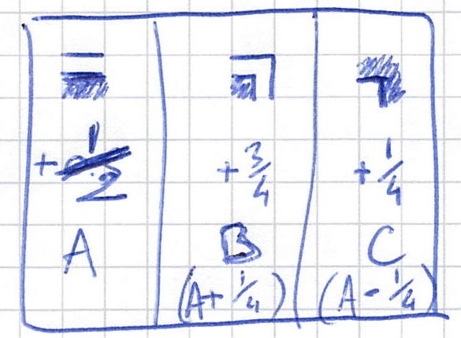

## Partie 1

Il faut creuser un lagon pour stocker de la lave ?

```no_run
R 6 (#70c710)
D 5 (#0dc571)
L 2 (#5713f0)
D 2 (#d2c081)
R 2 (#59c680)
D 2 (#411b91)
L 5 (#8ceee2)
U 2 (#caa173)
L 1 (#1b58a2)
U 2 (#caa171)
R 2 (#7807d2)
U 3 (#a77fa3)
L 2 (#015232)
U 2 (#7a21e3)
```

C'est un programme d'excavation. On extrait des blocs d'un mètre cube, comme dans Minecraft, en se déplaçant dans une direction (`U/D/L/R` à chaque fois). Il y a aussi des couleurs pour peindre la tranchée, mais c'est pour plus tard apparemment.

La question de la première partie, c'est le nombre de cubes qui auront été enlevés si on parcourt d'abord le chemin indiqué (qui fait une boucle, apparemment) :

```no_run
#######
#.....#
###...#
..#...#
..#...#
###.###
#...#..
##..###
.#....#
.######
```

Puis qu'on remplit l'intérieur (tiens, ça me rappelle quelque chose) :

```no_run
#######
#######
#######
..#####
..#####
#######
#####..
#######
.######
.######
```

Je me dis que pour cette dernière opération je pourrai peut-être réutiliser du code du [jour 10](Jour%2010) ?

Allez c'est parti pour la lecture de l'entrée. C'est un peu plus sophistiqué que ces derniers jours, mais rien de méchant. Je choisis de stocker les directions, les distances et les couleurs dans 3 tableaux séparés.

```
Parse ← ⊜(°□⊢⊙⋕⊙∩°□°[⊙⊙∘] ⊜□ ¬∊:" #()".) ≠@\n.

$ R 6 (#70c710)
$ D 5 (#0dc571)
$ L 2 (#5713f0)
$ D 2 (#d2c081)
$ R 2 (#59c680)
$ D 2 (#411b91)
$ L 5 (#8ceee2)
$ U 2 (#caa173)
$ L 1 (#1b58a2)
$ U 2 (#caa171)
$ R 2 (#7807d2)
$ U 3 (#a77fa3)
$ L 2 (#015232)
$ U 2 (#7a21e3)

Parse
```

Je réalise que je ne sais pas quelle taille doit faire le terrain. Je pourrais l'agrandir au fur et à mesure ?

Je tente une petite exploration : je fais simplement la somme des `U`, des `L`, etc :

```
Parse ← ⊜(°□⊢⊙⋕⊙∩°□°[⊙⊙∘] ⊜□ ¬∊:" #()".) ≠@\n.
Directions ← [0_1 ¯1_0 0_¯1 1_0]
DirLetters ← "RULD"

$ R 6 (#70c710)
$ D 5 (#0dc571)
$ L 2 (#5713f0)
$ D 2 (#d2c081)
$ R 2 (#59c680)
$ D 2 (#411b91)
$ L 5 (#8ceee2)
$ U 2 (#caa173)
$ L 1 (#1b58a2)
$ U 2 (#caa171)
$ R 2 (#7807d2)
$ U 3 (#a77fa3)
$ L 2 (#015232)
$ U 2 (#7a21e3)

Parse
⊙⊙;               # on laisse tomber les couleurs
↘4 ⊛ ⊂ DirLetters # on remplace les lettres par des numéros de directions
⊏ :Directions     # puis par les vecteurs
×                 # multipliés par les distances
\+
°⊟⇌⍉
∩[⊃/↧/↥]
⍉⊟
```

Si sur l'exemple on va bien de `0 0` à `9 6`, avec l'entrée complète on va de `¯256 0` à `165 378`.

Bon, mais maintenant que je sais calculer cette étendue justement, rien ne s'oppose à ce que j'en déduise une taille de terrain appropriée et un point de départ.

Si je prends la négation du coin supérieur gauche comme point de départ, je devrais ne visiter que des points de coordonnées non négatives.

Bon, c'est assez facile de construire la matrice des cases visitées par la boucle (merci `un``where`), mais ensuite il faut calculer la surface incluse. Bien sûr que ça ressemble au jour 10. Mais au jour 10, j'avais exploiter le fait qu'on me disait quelle forme avaient les murs (horizontaux ou verticaux) et surtout les coins (à part ce satané point de départ). J'avais constaté que je pouvais me contenter de considérer uniquement les cases pour lesquelles le trajet traversait verticalement le bas de la case (donc `│`, `┐` et `┌`) comme délimitant sur chaque ligne l'entrée et la sortie dans le polygone, et il me suffisait ensuite de compter les espaces inclus dans les parties intérieures.

Remplir la grille avec des symboles différents pour les traits verticaux, c'est faisable. Plus compliqué pour les coins. Je fais quelques tentatives un peu hasardeuses de m'en passer. Au bout d'un moment, par quelque miracle j'obtiens le bon résultat sur l'exemple. Je m'empresse donc de soumettre la réponse que j'obtiens, pour apprendre qu'elle est en-dessous de la bonne réponse. C'est rageant, mais mérité en même temps.

Je change un peu l'approche (je me mets carrément à utiliser une expression régulière), ça passe toujours sur l'exemple, mais à nouveau _your answer is too low_.

En désespoir de cause, je me tourne vers des moyens non conventionnels, [comme j'avais exploré au jour 10](http://localhost:3000/blog/Jour%2010#en-bonus,-une-solution-dans-gimp) toujours mais après avoir trouvé la bonne réponse avec du code : je génère une image de la matrice obtenue et j'utilise un éditeur d'image pour la remplir et compter les pixels.


J'arrive à me planter encore une fois (l'histogramme dans Gimp ne compte que les pixels actuellement sélectionnés, et en plus il y a un [bug](https://gitlab.gnome.org/GNOME/gimp/-/issues/5952) dans ma version de Gimp qui l'empêche d'afficher la sélection) puis je soumets enfin une réponse qui est acceptée.

Je ne suis pas fier. Mais au moins je peux lire l'énoncé de la partie 2 et ne pas m'acharner sur une approche qui n'a peut-être pas d'avenir.

## Partie 2

Il s'avère que les directions et les distances utilisées jusqu'à présent ne sont pas les bonnes. Au lieu de ça il faut utiliser ce qu'on avait pris pour une couleur, mais le décoder de la façon suivante : lire les 5 premiers caractères comme un nombre hexadécimal (la distance à parcourir) et le dernier comme la direction (`0` pour la droite, `1` en bas, `2` à gauche et `3` en haut).

Vu les distances que je vais obtenir en convertissant ces nombres hexadécimaux à 5 chiffres, il n'y a effectivement aucune chance que mon approche de remplir une matrice reste viable (à vue de nez ça ferait une matrice de 16 Go, je suis sûr qu'il y en a qui l'ont fait cela dit).

Je m'octroie donc une pause pour réfléchir à une stragégie plus intelligente.

Pendant la pause, j'envisage d'abord de parcourir l'espace en gérant une liste d'intervalles actifs. J'envisage aussi de faire de la compression d'intervalles pour me ramener à un problème sur une matrice de taille raisonnable — mais comme je n'ai même pas réussi à faire marcher mon code sur la partie 1, ça n'est pas prometteur.

Finalement me revient en tête une approche assez élégante pour calculer la surface d'un polygone. Il s'agit d'ajouter pour chaque déplacement vers la droite, la surface du rectangle correspondant à "l'ombre portée" par ce segment sur l'axe des abscisses (horizontal). Et pour les déplacements vers la gauche, soustraire la même "ombre portée". Ici, on n'a pas besoin de considérer les déplacements verticaux puisque leur ombre est vide.

Le nom répandu (que je n'avais pas en tête) pour cette approche est [Trapezoid formula](https://en.wikipedia.org/wiki/Shoelace_formula#Trapezoid_formula_2). Je glisse ici une image issue de Wikipedia qui illustre bien le principe :


Le problème qui me reste, c'est que les "bords" de ma forme n'ont pas une épaisseur infinitésimale comme un polygone mathématique. La surface entière de chaque cellule traversée doit être ajoutée à la surface finale.

Mais ce n'est pas aussi simple que d'ajouter le nombre de cellules du périmètre (facile à calculer, c'est la somme des longueurs des déplacements). En effet le polygone traverse les cellules par le milieu et inclut donc déjà une partie de la surface de chaque cellule.

Je commence par chercher un moyen de compter correctement ces cellules du bord. Si je prenais une ligne qui passe une demi-case au-dessus du polygone de base quand on va vers la droite, et une demi-case en-dessous quand on va vers la gauche ? Si je comptais les lignes verticales comme ayant une largeur de `1` mais en "raccourcissant" les lignes horizontales pour éviter de compter des cases en double ?

Je fais quelques premiers gribouillages sur un papier (quand on sort le papier, c'est signe que le problème nécessite une réflexion approfondie…) mais je n'arrive pas à discerner de règle qui marche universellement.

Je recommence sur un papier quadrillé avec une autre idée : peut-être que je peux trouver une relation entre l'aire du polygone (qui traverse les cases), le nombre de cases traversées par celui-ci, et l'aire recherchée ?

Je fais quelques calculs d'aire à la main sur différentes formes de polygone. Périmètre de `8` cases, surface intérieure de `3` cases, surface finale de `8` cases. Périmètre de `12` cases, surface intérieure de `9` cases, surface finale de `16` cases. Périmètre de `16` cases, surface intérieure de `7` cases, surface finale de `16` cases. Périmètre de `16` cases, surface intérieure de `8` cases, surface finale de `17` cases.


Je n'arrive pas à discerner la "bonne" formule, d'autant que je ne suis pas sûr qu'elle existe à ce stade.

J'essaie de voir de quoi est composée cette fameuse "bordure" qui existe entre le polygone interne et le bord des cases parcourues. Pour les cases traversées de part en part, il y a une demi-case qui est laissée "en-dehors" du polygone, c'est facile. Pour les cases où le chemin tourne vers la droite (en supposant que l'intérieur de la forme se trouve à droite du chemin), trois quarts de la case sont laissés en-dehors. Et pour les cases où le chemin tourne à gauche, un quart de la case est laissé.



Du coup, si je compte combien il y a de chaque type de coin, je devrais pouvoir calculer la surface de cette bordure.

Les coins apparaissent à chaque fois que le chemin prend un virage, bien sûr. Après une rapide vérification, dans l'entrée à chaque étape on change de direction, d'ailleurs (sinon il m'aurait suffi de fusionner les mouvements consécutifs dans la même direction).

Pour connaître le type d'un coin (tourne à gauche ou à droite), je commence par énumérer les cas : `RD` tourne à droite, `RU` tourne à gauche, etc. Mais je me rends compte ensuite que je peux plutôt utiliser le signe du produit vectoriel entre les deux directions successives.

Tout ça me mène à une formule dont je suis assez content : `P/2 + (B - C) / 4`, où `B` est le nombre de coins qui tournent à droite et `C` le nombre de coins qui tournent à gauche.


(Je suis assez content de ma formule parce que je l'ai trouvé tout seul. Mais par la suite, en voyant comment d'autres s'y sont pris, je découvre qu'on pouvait faire `P/2 + 1` tout simplement. En y réfléchissant, c'est logique : puisque la boucle se termine dans la même direction qu'au départ, la différence entre le nombre de fois qu'on tourne à droite et le nombre de fois qu'on tourne à gauche est toujours de `4`…).

Armé de cette belle expression mathématique, je jette tout le code que j'avais écrit jusque-là et j'obtiens rapidement la bonne réponse (que j'avais déjà soumise) pour la partie 1.

Pour la deuxième partie, la conversion des données se fait facilement et bien sûr, le calcul n'est pas plus long.

Voici donc le code final auquel je suis arrivé (avec le calcul complètement inutile des formes de coins, voir plus haut) :

```
Parse ← ⊜(°□⊢⊙⋕⊙∩°□°[⊙⊙∘] ⊜□ ¬∊:" #()".) ≠@\n.
Directions ← [1_0 0_¯1 ¯1_0 0_1]
DirLetters ← "RDLU"
LettersToDirections ← ⊏: Directions ⊗:DirLetters
ToVectors ← × LettersToDirections
DropOdd ← ▽¬◿2⇡⧻.
Inside ← /+ ×⊓(⊢⇌|⊢) ∩⍉ ∩DropOdd \+.
Det ← /- /× ⍜⊢⇌
Border ← (
  ⊓(
    ⍉ ⊟ ↻1.
    ≡Det # types de coins
    /+
    # ici on aura toujours 4 !
  | ×2/+ # périmètre * 2
  )
  ÷4+
)
Area ← + ⊃(Border|Inside ×) LettersToDirections
PartOne ← Area ⊙⊙; Parse
ParseHex ← ∧(+ ⊙(×16)) ⊙0 ◿39-@0
Decode ← ≡⊃(⊡:DirLetters-@0⊢⇌|ParseHex↙5)
PartTwo ← Area ⋅⋅Decode Parse

$ R 6 (#70c710)
$ D 5 (#0dc571)
$ L 2 (#5713f0)
$ D 2 (#d2c081)
$ R 2 (#59c680)
$ D 2 (#411b91)
$ L 5 (#8ceee2)
$ U 2 (#caa173)
$ L 1 (#1b58a2)
$ U 2 (#caa171)
$ R 2 (#7807d2)
$ U 3 (#a77fa3)
$ L 2 (#015232)
$ U 2 (#7a21e3)

⍤⊃⋅∘≍ 62 PartOne .
⍤⊃⋅∘≍ 952408144115 PartTwo
```

### Bonus

Je me suis demandé à quoi aurait ressemblé le dessin si on avait vraiment utilisé les couleurs indiquées. Et puis ça m'a permis de recycler un peu de code de ma première tentative…

* Partie 1 :


* Partie 2 :


Pas de message caché, dommage !
