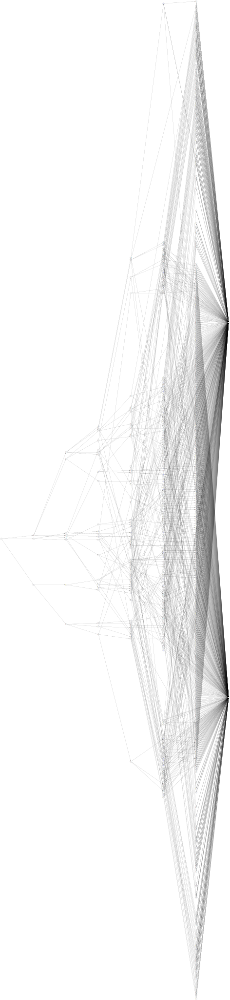

## Partie 1

Houla, il va y avoir du travail de _parsing_ aujourd'hui.

```no_run
px{a<2006:qkq,m>2090:A,rfg}
pv{a>1716:R,A}
lnx{m>1548:A,A}
rfg{s<537:gd,x>2440:R,A}
qs{s>3448:A,lnx}
qkq{x<1416:A,crn}
crn{x>2662:A,R}
in{s<1351:px,qqz}
qqz{s>2770:qs,m<1801:hdj,R}
gd{a>3333:R,R}
hdj{m>838:A,pv}

{x=787,m=2655,a=1222,s=2876}
{x=1679,m=44,a=2067,s=496}
{x=2036,m=264,a=79,s=2244}
{x=2461,m=1339,a=466,s=291}
{x=2127,m=1623,a=2188,s=1013}
```

Apparemment il s'agit d'un programme pour classer des pièces, qui sont données en bas.

Chaque pièce (il y en a `200` dans l'entrée) a quatre attributs, `x`, `m`, `a` et `s`. Chacune commence dans l'état `in`. Puis applique les différentes conditions pour se promener entre les états, jusqu'à arriver à `R` ou `A`. Ensuite il faut faire la somme des `x`, `m`, `a` et `s` pour toutes les pièces acceptées.

Attaquons donc l'analyse de ce texte. Je vais tout de suite numéroter les états. Enfin, après avoir lu toutes les règles quand même.

```
ParseRule ← ⍜°□(
  ⊜□ ¬∊:",{}".
  ⊃(
    ↘1
    ≡(
      °□
      ⊜□≠@:.
      >1⧻.
      (
        [0 ¯∞ ∞ ⊢]
        | °⊟
        ∩°□
        ⊃(
          ⊗:"xmas"⊢
            | =@>⊃(⊡1|⋕↘2)
          (¯∞|:∞)
        )
        {⊙⊙⊙∘}
      )
    )
  | ⊢
  )
)
NumberStates ← (
  ⊙¤
  ≡(
    ⊙¤
    ⍜°□ ≡(
      ⍜(⊢⇌)(□ -2⊗)
      ≡°□
    )
  )
)
SortStates ← ⍜:(
  ⍖=□"in".
  ,:
  ∩⊏
  ⊂ {"A" "R"}
)
ParsePart ← ⊜⋕ ∊:"0123456789". °□
Parse ← (
  ∩°□°⊟⊜(□⊜□≠@\n.)¬⌕"\n\n".
  :⊓(NumberStates SortStates ≡ParseRule|≡ParsePart)
)

$ px{a<2006:qkq,m>2090:A,rfg}
$ pv{a>1716:R,A}
$ lnx{m>1548:A,A}
$ rfg{s<537:gd,x>2440:R,A}
$ qs{s>3448:A,lnx}
$ qkq{x<1416:A,crn}
$ crn{x>2662:A,R}
$ in{s<1351:px,qqz}
$ qqz{s>2770:qs,m<1801:hdj,R}
$ gd{a>3333:R,R}
$ hdj{m>838:A,pv}
$
$ {x=787,m=2655,a=1222,s=2876}
$ {x=1679,m=44,a=2067,s=496}
$ {x=2036,m=264,a=79,s=2244}
$ {x=2461,m=1339,a=466,s=291}
$ {x=2127,m=1623,a=2188,s=1013}
Parse
```

Voilà, les noms d'états ont complètement disparu au profit d'indices (j'ai pris soin de faire en sorte que `in` ait l'indice `0`, et j'ai ajouté `A` et `R` en indices `-2` et `-1` respectivement). Et chaque règle est exprimée par un tableau de `4` éléments : attribut à tester, minimum, maximum, nouvel état. J'ai glissé des `∞` et des `-∞` aux bons endroits pour ne pas avoir à distinguer `<` de `>`. Et pour les cas inconditionnels, on testera simplement si l'attribut `0` (`x`) est entre `-∞` et `∞`.

Me voici armé pour l'exécution des règles.

En fait, je me retrouve plusieurs fois à retoucher l'analyseur d'entrée ci-dessus (le code ci-dessus est la dernière version) que je pensais être au point.

Mais une fois qu'il est vraiment au point, l'application des _workflows_ se fait sans difficulté particulière. Ma numérotation des états me permet de donner comme condition d'arrêt le fait d'atteindre un état négatif.

```
ParseRule ← ⍜°□(
  ⊜□ ¬∊:",{}".
  ⊃(
    ↘1
    ≡(
      °□
      ⊜□≠@:.
      >1⧻.
      (
        [0 ¯∞ ∞ ⊢]
        | °⊟
        ∩°□
        ⊃(
          ⊗:"xmas"⊢
            | =@>⊃(⊡1|⋕↘2)
          (¯∞|:∞)
        )
        {⊙⊙⊙∘}
      )
    )
  | ⊢
  )
)
NumberStates ← (
  ⊙¤
  ≡(
    ⊙¤
    ⍜°□ ≡(
      ⍜(⊢⇌)(□ -2⊗)
      ≡°□
    )
  )
)
SortStates ← ⍜:(
  ⍖=□"in".
  ,:
  ∩⊏
  ⊂ {"A" "R"}
)
ParsePart ← ⊜⋕ ∊:"0123456789". °□
Parse ← (
  ∩°□°⊟⊜(□⊜□≠@\n.)¬⌕"\n\n".
  :⊓(NumberStates SortStates ≡ParseRule|≡ParsePart)
)
ApplyWorkflow ← (
  ⊃(⊏ ⊢|°[⊙⊙∘] ↘1)⍉
  ↧⊓<>,:
  ⊢▽
)
Step ← (
  ⊃(
    ⊃(°□⊡⊙;|⋅∘)
    ApplyWorkflow
  | ⋅⊙∘
  )
)
ApplyWorkflows ← (
  0 # initial state (in)
  ⍢Step(≥0)
  ⊙⋅;
  =¯2
)
PartOne ← (
  Parse
  ⊃∘(
    ⊙¤
    ≡ApplyWorkflows
  )
  ▽:
  /+♭
)

$ px{a<2006:qkq,m>2090:A,rfg}
$ pv{a>1716:R,A}
$ lnx{m>1548:A,A}
$ rfg{s<537:gd,x>2440:R,A}
$ qs{s>3448:A,lnx}
$ qkq{x<1416:A,crn}
$ crn{x>2662:A,R}
$ in{s<1351:px,qqz}
$ qqz{s>2770:qs,m<1801:hdj,R}
$ gd{a>3333:R,R}
$ hdj{m>838:A,pv}
$
$ {x=787,m=2655,a=1222,s=2876}
$ {x=1679,m=44,a=2067,s=496}
$ {x=2036,m=264,a=79,s=2244}
$ {x=2461,m=1339,a=466,s=291}
$ {x=2127,m=1623,a=2188,s=1013}

⍤⊃⋅∘≍ 19114 PartOne
```

## Partie 2

Je n'ai pas été très rapide sur cette première partie, mais ça s'est déroulé assez tranquillement. Voyons ce que nous réserve la deuxième.

Il faut abandonner la liste de pièces qui nous était donnée, et imaginer un grand ensemble de pièces contenant toutes les combinaisons possibles donnant à `x`, `m`, `a` et `s` des valeurs entre `1` et `4000`. Combien de pièces dans cette ensemble seront acceptées (`A`) ?

Commençons par construire cet ensemble… Non je rigole. En arrondissant à `4096` c'est-à-dire `2^12`, on arriverait à `2^48` soit environ `2,8e+14` éléments.

Bon, encore un problème d'énumération.

Mettons que je commence avec un énorme bloc virtuel de `2^48` éléments, tous dans l'état `0` (`in`).

Une fois passés à la moulinette du premier _workflow_, si celui-ci a deux états de sortie possible comme dans l'exemple (`in{s<1351:px,qqz}`), alors j'aurai deux blocs : ceux dont le `s` est inférieur à `1351`, et les autres.

Ensuite pour chacun de ces deux blocs, je pourrai appliquer le _workflow_ sélectionné (`px` ou `qqz`). Ce qui me donnera `3` nouveaux blocs en partant de `px` et `3` autres en partant de `qqz` :
* `s<1351 et a<2006` : `qkq`
* `s<1351 et m>2090` : `A`
* `s<1351 et a>=2006 ou m<=2090` : `rfg`
* `s>=1351 et s>2770` : `qs`
* `s>=1351 et m<1801` : `hdj`
* `s>=1351 et s<=2770 ou m>=1801` : `R`

Je remarque que je peux simplifier le cas `s>=1351 et s>2770` en `s>2770`.

Si je représente chaque "bloc" par une série d'intervalles pour chaque attribut, je devrais pouvoir parcourir la liste des _workflows_ et finir avec _n_ blocs, dont je pourrai connaître la taille de chacun en multipliant la taille de ses listes d'intervalles d'attributs.

Mais d'abord, une "petite" visualisation.



E)t puis c'est l'heure de la pause. J'ai déjà ma petite idée sur une réprésentation facile pour les listes d'intervalles, mais j'aurai peut-être une meilleure idée en pédalant.

### Après la pause

Je n'ai pas eu de meilleure idée, alors continuons avec celle-ci : je vais représenter chaque "bloc" de pièces par une liste de quatre listes d'entiers. Autrement dit, `[ [1 2 3] [1 2 3 4 5] [3 4 5] [7 8 9] ]` représente l'ensemble des pièces qui ont à la fois un `x` parmi `1 2 3`, un `m` parmi `1 2 3 4 5`, un `a` parmi `3 4 5` et un `s` parmi `7 8 9`.

C'est un peu dispendieux comme représentation — le bloc initial contient `16000` nombres en tout — mais j'aime bien l'idée de pouvoir assez simplement appliquer les mêmes règles que pour la première partie, à savoir comparer chacun de ces nombres avec le minimum et le maximum que j'ai lus dans l'entrée. Plus efficace serait de ne stocker que le minimum et le maximum, puisque je ne vais traiter que des intervalles et pas des sous-ensembles arbitraires des entiers naturels. Mais ça me ferait faire des comparaisons plus compliquées pour intersecter ces intervalles, ce que j'aimerais mieux éviter.

J'avance doucement dans l'implémentation. Je suis arrivé à une approche qui marche pas mal pour écrire des boucles avec Uiua : je commence par créer manuellement un état initial (ici, notamment, la liste des blocs associé chacun à leur "état" actuel, donc `in` (c'est-à-dire `0`) et le bloc `1..4000 1..4000 1..4000 1..4000`) puis j'écris le code qui transforme cet état, en surveillant la pile résultante, jusqu'à arriver à un état modifié qui ait la même forme que l'état initial.

Ici l'état que je préserve d'itération en itération est le suivant :
* une pile de paires `(état, bloc)` à traiter ;
* le nombre total de pièces validées jusqu'à présent.

À chaque itération, je prends la première paire `(état, bloc)` de la pile, je récupère le _worfklow_ correspondant à cet état, puis j'applique les règles correspondantes au bloc successivement : chaque règle me donne un nouveau bloc constitué du sous-bloc passant le test, associé à l'état cible ; et un autre bloc correspondant au complément, représentant les pièces qui n'ont pas passé ce test.

Une fois toutes les règles d'un bloc appliquées, je vérifie que le bloc restant est vide : cela devrait toujours être le cas grâce à la règle "universelle" qui existe en fin de chaque _workflow_. Je me retrouve avec une liste de nouvelles paires `(état, bloc)`. J'enlève de cette liste les blocs qui sont arrivés dans l'état `-1` (alias `R`), et pour chaque bloc arrivé en `-2` (alias `A`), je calcule le nombre de pièces que représente ce bloc en multipliant les longueurs de ses intervalles.

J'ajoute ce nombre de pièces à mon total et j'empile les nouvelles paires sur la pile.

Il me suffit de répéter cette opération jusqu'à ce que la pile soit vide.

J'obtiens la bonne réponse sur l'exemple. Puis je lance sur l'entrée complète, avec une toute petite inquiétude quant à l'utilisation mémoire de ma représentation d'intervalles… mais ça se passe très bien.

```
ParseRule ← ⍜°□(
  ⊜□ ¬∊:",{}".
  ⊃(
    ↘1
    ≡(
      °□
      ⊜□≠@:.
      >1⧻.
      (
        [0 ¯∞ ∞ ⊢]
        | °⊟
        ∩°□
        ⊃(
          ⊗:"xmas"⊢
            | =@>⊃(⊡1|⋕↘2)
          (¯∞|:∞)
        )
        {⊙⊙⊙∘}
      )
    )
  | ⊢
  )
)
NumberStates ← (
  ⊙¤
  ≡(
    ⊙¤
    ⍜°□ ≡(
      ⍜(⊢⇌)(□ -2⊗)
      ≡°□
    )
  )
)
SortStates ← ⍜:(
  ⍖=□"in".
  ,:
  ∩⊏
  ⊂ {"A" "R"}
)
ParsePart ← ⊜⋕ ∊:"0123456789". °□
Parse ← (
  ∩°□°⊟⊜(□⊜□≠@\n.)¬⌕"\n\n".
  :⊓(NumberStates SortStates ≡ParseRule|≡ParsePart)
)
ApplyWorkflow ← (
  ⊃(⊏ ⊢|°[⊙⊙∘] ↘1)⍉
  ↧⊓<>,:
  ⊢▽
)
Step ← (
  ⊃(
    ⊃(°□⊡⊙;|⋅∘)
    ApplyWorkflow
  | ⋅⊙∘
  )
)
ApplyWorkflows ← (
  0 # initial state (in)
  ⍢Step(≥0)
  ⊙⋅;
  =¯2
)
PartOne ← (
  Parse
  ⊃∘(
    ⊙¤
    ≡ApplyWorkflows
  )
  ▽:
  /+♭
)
MakeDot ← (
  °□⊢⊜□¬⌕"\n\n".
  /⊐⊂⊜(
    ⊗ @{.
    □$"_\n" ⊂⊃(
      $"\"_\" -> "↙
    | ↘¯1/⊐⊂⊜(□$"\"_\","⇌↙ ⊗ @:.)≠@,.⇌↘¯1↘+1
    )
  )≠@\n.
  $"digraph {rankdir=LR;ranksep=10;splines=false;\n_}\n"
)
# ( rule block instateblocks -- outblock instateblocks )
ApplyRuleToBlock ← (|3.2
  # -- rule block instateblocks
  °[⊙⊙⊙∘] # unpack rule
  # -- attrindex min max next block instateblocks
  ⊃(
    ⊙⋅⋅⋅∘ # -- attrindex block
  | ⋅⊙⊙∘
  )
  # -- attrindex block min max next inblockstates
  ⊃(
    ⊙∘  # keep attrindex and block
  | °□⊡ # pick attribute range
    # -- range min max
    # compare range
    ↧⊃(<|>⊙;|∘)
    # split range
    ∩□⊃▽(▽¬)
    # -- inrange outrange
  )
  # -- attrindex block inrange outrange next instateblocks
  ⊃(⊙⊙∘|⊙⊙⋅∘)
  # -- attrindex block inrange attrindex block outrange next instateblocks
  ∩(⍜⊡⋅∘)
  # -- inblock outblock next instateblocks
  ⊃(
    ⋅∘     # keep outblock
  |        # append to instateblocks
    {:⊙⋅∘} # couple outblock and nextstate
    ⊂¤
  )
  # -- outblock instateblocks'
)
# ( maximum -- block )
InitialBlock ← (
  +1⇡ # 1 to max
  ▽ 4 □
)
# ( stateblock workflows -- newstateblocks )
Expand ← (|2
  # -- stateblock workflows
  ∩°□°⊟
  # -- state block workflows
  ⊃(°□⊡⊙⋅∘|⋅∘) # get workflow from state
  # -- workflow block
  ⊙⊙(
    [] # newstateblocks
  )
  # -- workflow block newstateblocks
  ∧(|3.2
    ApplyRuleToBlock
  )
  # -- finalblock newstateblocks
  ⍤"final block should have empty range"≍□[]⊢
  # -- newstateblocks
)
# ( stateblocks -- accepted stateblocks' )
CountAndFilter ← (|1.2
  # -- newstateblocks
  ≡°□⊢⍉. # get states
  ⊃(
    =¯2
    ▽
    ;°⊟⍉
    ≡(
      °□
      ≡⧻
      /×
    )
    /+
  | ▽≥0
  ) # count accepted, remove rejected
  # -- newaccepted newstateblocks
)
Step ← (
  ⊃(
    ↘1 # remaining stateblocks
  | ⊢  # pop first stateblock
    # -- stateblock totalaccepted workflows
    ⊃(
      ⋅∘ # keep totalaccepted
    | ⊙; # drop totalaccepted
      Expand
      # -- newstateblocks
      CountAndFilter
      # -- newaccepted newstateblocks
    | ⋅⋅∘ # keep workflows
    )
    # -- totalaccepted newaccepted newstateblocks workflows
    :+
    # -- stateblocks accepted workflows
  )
  ⊂: # insert new stateblocks in stack
)
# ( maximum workflows -- totalaccepted )
Loop ← (
  # -- workflows
  [{0 InitialBlock ∘}] # init stack of stateblocks
  # -- stateblocks workflows
  ⊙0
  # -- stateblocks totalaccepted workflows
  ⍢(Step|±⧻) # until stateblocks empty
  ⋅⊙;        # keep only totalaccepted
  # -- totalaccepted
)
PartTwo ← (
  ;Parse
  Loop 4000
)

$ px{a<2006:qkq,m>2090:A,rfg}
$ pv{a>1716:R,A}
$ lnx{m>1548:A,A}
$ rfg{s<537:gd,x>2440:R,A}
$ qs{s>3448:A,lnx}
$ qkq{x<1416:A,crn}
$ crn{x>2662:A,R}
$ in{s<1351:px,qqz}
$ qqz{s>2770:qs,m<1801:hdj,R}
$ gd{a>3333:R,R}
$ hdj{m>838:A,pv}
$
$ {x=787,m=2655,a=1222,s=2876}
$ {x=1679,m=44,a=2067,s=496}
$ {x=2036,m=264,a=79,s=2244}
$ {x=2461,m=1339,a=466,s=291}
$ {x=2127,m=1623,a=2188,s=1013}

⍤⊃⋅∘≍ 19114 PartOne.
⍤⊃⋅∘≍ 167409079868000 PartTwo
```
