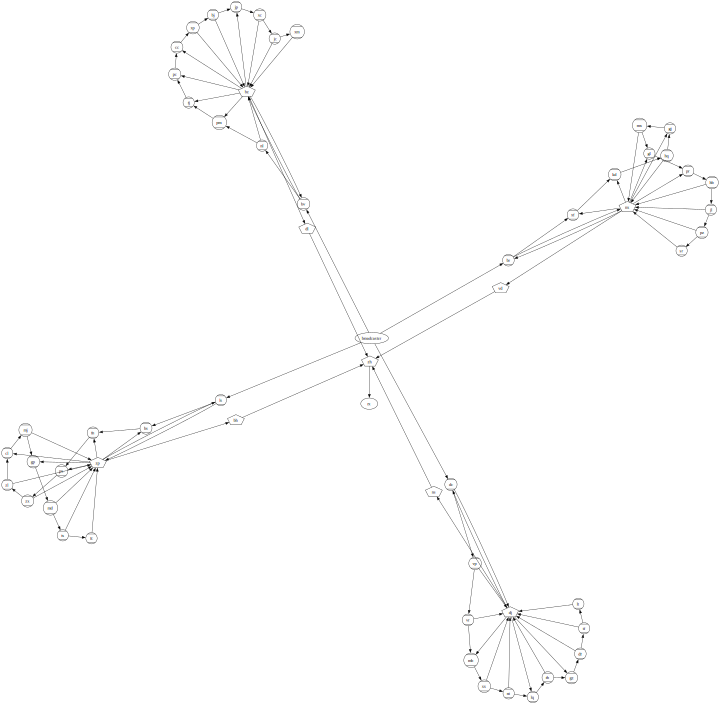

##### Aller au jour : [1](Jour%201) [2](Jour%202) [3](Jour%203) [4](Jour%204) [5](Jour%205) [6](Jour%206) [7](Jour%207) [8](Jour%208) [9](Jour%209) [10](Jour%2010) [11](Jour%2011) [12](Jour%2012) [13](Jour%2013) [14](Jour%2014) [15](Jour%2015) [16](Jour%2016) [17](Jour%2017) [18](Jour%2018) [19](Jour%2019) 20 [21](Jour%2021) [22](Jour%2022) [23](Jour%2023) [24](Jour%2024) [25](Jour%2025) 

# Jour 20

## Partie 1

Aujourd'hui c'est graphe, apparemment :

```no_run
broadcaster -> a, b, c
%a -> b
%b -> c
%c -> inv
&inv -> a
```

Tiens, avant de lire la suite de l'énoncé je vais faire une petite visualisation Graphviz, pour voir.

Je pourrais traiter le fichier d'entrée avec `awk` pour générer le source Graphviz et ça irait plus vite, mais j'en profite pour écrire la parser en Uiua.



D'accord, et il faut faire quoi avec ce graphe? J'ai vu qu'il était question de signaux hauts et bas, et de _flip-flops_…

Les elfes appuient sur un bouton `1000` fois. Chaque appui du bouton envoie un signal `bas` depuis le module `broadcaster`.

Les modules précédés d'un `%` sont des _flip-flops_ donc, qui mémorisent un état `on` ou `off` et commencent à `off`. Ils ne font rien quand ils reçoivent un signal `haut` mais quand ils reçoivent un signal `bas`, ils inversent leur état interne puis envoient un signal `haut` s'ils sont passés à `on` ou `bas` s'ils sont passés à `off`.

Les modules précédés d'un `&` sont des modules de _conjonction_ et ont plusieurs entrées. Quand ils reçoivent une impulsion, ils mettent à jour l'état de l'entrée correspondante (qui commence à `bas`). Puis ils envoient une impulsion `bas` si toutes les entrées sont mémorisées à `haut`, sinon ils envoient une impulsion `haut`.

On me précise aussi que chaque impulsion doit être traitée avant de traiter ses conséquences.

Ce dernier point me fait penser que je pourrais avoir une file d'impulsions où chaque entrée est composée d'un niveau (`haut` ou `bas`) et d'un module cible.

Je commence par numéroter les modules pour n'avoir plus que deux listes : une liste de types de nœuds (`1` pour _flip-flop_, `2` pour _conjonction_) et une liste de destinations (indices des nœuds de sortie).

Il va me falloir aussi une mémoire pour chacun des nœuds. Les _flip-flops_ ont un bit de mémoire mais les _conjonctions_ mémorisent autant de bits qu'ils ont d'entrées.

Hmm, est-ce que ça veut dire qu'il me faudrait aussi énumérer les arêtes entrantes des nœuds _conjonction_ ? Peut-être pas, si je précalcule uniquement le nombre d'arêtes entrantes, et dans l'état du nœud je pourrais avoir une liste des nœuds qui lui ont envoyé un signal `haut`? Ainsi je saurais quand envoyer une impulsion `bas`.

Alternativement je pourrais avoir ces arêtes entrantes (indices des nœuds émettant vers celui-ci) et l'état serait composé d'un masque binaire.

Et si globalement je ne conservais que les arêtes entrantes ? L'état de chaque nœud pourrait être la dernière impulsion émise. La file des impulsions indiquerait quel nœud a changé, et le traitement d'une entrée de la file consisterait à chercher quels nœuds ont ce nœud dans leurs entrées, puis ils se mettraient à jour en générant de nouvelles impulsions (ajoutées en fin de file).

La possibilité de n'avoir à mémoriser qu'un seul bit par nœud est tentante, mais j'ai des doutes sur le fait que ce soit vraiment équivalent à ce qui est décrit dans l'énoncé. Du coup je vais plutôt partir sur quelque chose de plus proche de la description, avec `n` bits stockés dans un nœud de _conjonction_.

J'ai quand même besoin de calculer les arêtes entrantes, de toute façon.

Ensuite, pour initialiser l'état, j'ai l'impression que chaque nœud a autant de bits d'état qu'il a d'arêtes entrantes. Ah non, un _flip-flop_ peut avoir plusieurs entrées, mais il n'a qu'un bit de mémoire.

Ah. Dans ma file d'impulsions à traiter, je ne peux pas me contenter de stocker le nœud cible de l'impulsion. Parce que les nœud _conjonction_ ont besoin de distinguer leurs différentes entrées, ils ont besoin de savoir d'où vient une impulsion.

J'avance doucement sur l'implémentation.

### Questions de style

Il y a quelque chose qui me travaille avec le style dans lequel j'écris en Uiua. Pour comprendre ce que je suis en train de faire, je me retrouve en train d'écrire presque deux lignes de commentaire pour chaque ligne de code (qui contient en général une poignée de symboles à peine) : un commentaire pour expliquer ce qu'on fait, et un autre pour visualiser l'état de la pile à ce moment-là.

J'essaie d'envisager des moyens de rendre le code lui-même plus explicite. Bien sûr, extraire des fonctions nommées aide, notamment à me passer du commentaire qui explique ce qu'on fait.

Un point sur lequel je trouve mon code particulièrement opaque, c'est la construction de données pour les tests unitaires. Voici un exemple :

```
# ( source level state type outputlist inputlist -- state' [target level] )
ApplyPulse ← 0 [[1 0] [2 0]];;;;;; # fake it till you make it

0 0 1 1 1_2 [3] # ← données en entrée
ApplyPulse
⍤⊃⋅∘≍ {0 [[1 0] [2 0]]} {⊙∘} # ← sortie attendue
```

La séquence `0 0` représente une impulsion basse depuis le nœud `0`, et la séquence `[] 1 1 1_2 []` représente un nœud de type `flip-flop` ayant pour sorties les nœuds `1` et `2`, pour entrée le nœud `3`, et un état `on`. Limpide, non ?

La première chose que je tente, c'est bien sûr de nommer quelques constantes (types de nœuds, état, niveau) :

```
B ← 0
F ← 1
C ← 2
High ← 1
Low ← 0
Off ← 0
On ← 1

# ( source level state type outputlist inputlist -- state' [target level] )
ApplyPulse ← Off [[1 Low] [2 Low]];;;;;; # fake it till you make it

0 Low On F 1_2 [3]
ApplyPulse
⍤⊃⋅∘≍ {Off [[1 Low] [2 Low]]} {⊙∘}
```

Mais le rôle de chaque valeur n'est toujours pas complètement évident. J'essaie quelque chose de nouveau : je déclare quelques fonctions qui ne font rien mais que je peux insérer entre les valeurs :

```
B ← 0
F ← 1
C ← 2
High ← 1
Low ← 0
Off ← 0
On ← 1

From ← ()
To ← ()
State ← ()
Type ← ()
Outputs ← ()
Inputs ← ()

# ( source level state type outputlist inputlist -- state' [target level] )
ApplyPulse ← State Off [[To 1 Low] [To 2 Low]];;;;;; # fake it till you make it

From 0 High
State On Type F Outputs 1_2 Inputs [3]
ApplyPulse
⍤⊃⋅∘≍ {State Off [[To 1 Low] [To 2 Low]]} {⊙∘}
```

C'est plus verbeux, mais on sait un peu plus de quoi on parle, non ?

Sur ma lancée, je me dis que je pourrais en profiter pour donner un autre travail à ces fonctions "décoratives" : elles pourraient valider que la donnée qui est à leur droite est du type attendu.

```
B ← 0
F ← 1
C ← 2
High ← 1
Low ← 0
Off ← 0
On ← 1

IsID ← ↧⊃(=0⧻△|=0type)
From ← ⊃⊙∘⊓(⍤⊃$"source _"IsID|⍤⊃$"level _"(∊:[Low High]))
To ← ⊃∘(⍤⊃$"dest _"IsID)
State ← ⍤⊃($"state _"|=0type|∘)
Type ← ⍤⊃($"type _"|∊:0_1_2|∘)
Inputs ← ⍤⊃($"inputs _"|±/↧≡IsID|∘)
Outputs ← ⍤⊃($"outputs _"|/↧≡IsID|∘)

⍤⊃⋅∘≍ "type 42" ⍣(Type 42)($"_")
⍤⊃⋅∘≍ "level 2" ⍣(From 1 C)($"_")
⍤⊃⋅∘≍ "source x" ⍣(From "x" Low)($"_")
⍤⊃⋅∘≍ "outputs abc" ⍣(Outputs "abc")($"_")

# ( source level state type outputlist inputlist -- state' [target level] )
ApplyPulse ← State Off [[To 1 Low] [To 2 Low]];;;;;; # fake it till you make it

From 0 High
State On Type F Outputs 1_2 Inputs [3]
ApplyPulse
⍤⊃⋅∘≍ {State Off [[To 1 Low] [To 2 Low]]} {⊙∘}
```

Voilà, j'ai maintenant quelques assertions de type. Ce n'est pas parfait parce qu'on peut encore faire `Type Off` par exemple. Je pourrais éviter ça en donnant des valeurs distinctes à chaque type de données, ou même aller jusqu'à représenter chaque valeur par un couple `{type valeur}`. Mais mis à part la complexité du système, je perdrais les avantages de représenter un maximum de valeurs par des nombres simples. Par exemple, représenter les types de nœuds par `0`, `1` ou `2` se prête très bien à l'utilisation des _switch functions_ qui prennent un entier pour désigner la branche à prendre. Ou encore, le fait de représenter les états `on` et `off` par `1` et `0` me permet d'appliquer des opérations booléennes dessus.

Bref, j'ai l'impression que c'est un compromis qui peut fonctionner et je suis curieux de voir ce que ça va donner.

D'ailleurs, maintenant que j'ai ces assertions de type je ne me prive pas de les utiliser en-dehors des tests. En fait je les saupoudre un peut partout où je sais qu'une valeur est d'un certain type, et ça me rassure en même temps que ça m'aide pour la relecture.

Un changement que je fais en cours de route, c'est de changer ma représentation des nœuds : au lieu d'avoir quatre tableaux sur la pile (types, listes de nœuds en sortie, listes de nœuds en entrée, noms), je me rends compte que même si ça évite certaines manipulations de boîtes, cette structure n'est pas très commode à manipuler. Je reviens donc un peu un arrière sur l'approche "tableaux parallèles" et je crée un tableau de nœuds contenant sur chaque ligne quatre boîtes correspondant aux attributs du nœud.

En revanche, je conserve les états des nœuds dans un tableau parallèle à côté sur la pile. Ça me paraît un bon compromis.

Implémenter la logique de simulation du circuit prend du temps, mais je commence à avoir l'habitude et avec méthode, je finis par en venir à bout.

Je commence par une version où les impulsions sont dépilées et traitées au fur et à mesure jusqu'à ce qu'il n'y en ait plus dans la file. Mais je me rends compte que j'ai envie de voir ce qui se passe. Je commence par ajouter un `&p` pour afficher chaque impulsion générée, mais ce n'est pas satisfaisant.

Comme de toute façon, pour avoir la réponse finale il faudra compter les impulsions hautes et basses, je décide d'ajouter simplement chaque impulsion dépilée dans une autre liste que j'appelle "historique". Et j'écris une fonction qui transforme cet historique en texte, exactement sous la forme donnée dans l'énoncé (`button -low-> broadcaster`…). J'ajoute un nœud `button` pour que ça ressemble vraiment aux illustrations de l'énoncé. Et je suis bien content quand je peux voir que ma trace est identique à celle attendue.

Je lance donc le calcul sur l'entrée complète, mais ça échoue avec un accès à un index trop grand dans le tableau des nœuds. Je comprends assez vite que dans ma fonction qui remplace les noms de nœuds par leurs indices, je me suis fait avoir par `indexof` qui renvoie la taille de la liste quand l'élément recherché ne s'y trouve pas. J'écris donc une fonction `SafeIndexOf` qui lance une exception avec `assert` dans ce cas. Ce qui me permet de repérer qu'il y a un nœud dans l'entrée (`rx`) qui apparaît comme destination d'un autre nœud mais jamais comme source.

Qu'à cela ne tienne, j'ajoute une ligne `rx -> ` à la fin de l'entrée lors de la lecture — comme il n'a pas de sortie, je pense que ça ne changera pas le résultat du calcul.

Plus qu'à utiliser l'historique pour calculer le nombre d'impulsions hautes et le nombre d'impulsions basses, multiplier ces deux nombres, et j'obtiens enfin ma première étoile, avec le code ci-dessous :

```
# Constants
B ← 0
F ← 1
C ← 2
High ← 1
Low ← 0
Off ← 0
On ← 1

# Type assertions
IsID ← /↧[⊃(=⁅.|=0⧻△|=0type)]
ID ← ⍤⊃($"id _"|IsID|∘)
From ← ⊃⊙∘⊓(⍤⊃$"from _"IsID|⍤⊃$"level _"(∊:[Low High]))
To ← ⍤⊃($"dest _"|IsID|∘)
State ← ⍤⊃($"state _"|=0type|∘)
Type ← ⍤⊃($"type _"|∊:0_1_2|∘)
Inputs ← ⍤⊃($"inputs _"|±/↧≡IsID|∘)
Outputs ← ⍤⊃($"outputs _"|±/↧≡IsID|∘)

# ( text -- types names outputlists )
Parse ← (|1.3
  ⊜(⊂∩□⊃(Type ◿3 ⊗:"b%&"⊢|⊜(□) ¬∊:" ->,".▽¬∊:"&%".)) ≠@\n.
  ∩°□°⊟⍉
  ⊓(
    ≡(Type °□)
  | ≡(⊃(⊢|⍜°□(↘1)))
  )
  ⍏. # sort by type (broadcaster first)
  ⊃(≡Type ⊏|⊏⊙⋅∘|⊏⊙⋅⋅∘)
)
# ( types names outputlists -- )
Dot ← (
  ≡(
    ⊙(
      # build edges
      ∩°□
      ⊙(↘¯1 °□/⊐⊂ ≡(⍜°□($"\"_\",")))
    )
    # -- type name neighbors
    ("color=black"|"shape=Mcircle"|"shape=pentagon")
    # -- color name neighbors
    ,
    # -- name color name neighbors
    $"\"_\" [_]\n\"_\" -> _\n"
    □
  )
  $"digraph {\n_}"/⊐⊂
  &fwa "day20.dot"
)
# ( needle haystack -- index )
SafeIndexOf ← (
  ⊃(
    ⊗
  | ⋅⧻
  | ⊙∘
  )
  ⊃(
    ∘
  | # -- index len needle haystack
    ⍤⊃($"_ not found in _";;|>)
  )
)
# ( names outputlists -- outputlists' )
NamesToIDs ← (
  # -- names outputlists
  :¤
  # -- outputlists [names]
  ≡⍜°□(
    ±⧻.
    (
      ;;
      Outputs []
    | ⊙¤ # fix names
      ≡SafeIndexOf
      Outputs
    )
  )
  # -- outputlists'
)
# ( outputlists -- inputslist )
FindInputs ← (
  ⊃(⇡⧻)¤ # make ids, fix outputlists
  # -- ids outputlists
  ≡⍜°□(
    # -- id outputlists
    ≡(∊⊙°□) # membership of my index in all outputlists
    # -- membershipbits
    Inputs ⊚
  )
)

# ( nodes -- states )
InitStates ← (|1
  ≡(
    °{⊙⊙∘}↙3
    # -- type outputs inputs
    ⊙⋅∘
    # -- type inputs
    (
      # broadcaster: no state
      []
    | # flip-flop: one bit
      0
    | # conjunction: one bit per input
      ≡⋅0
    )
    □
  )
)

# ( types names nameoutputlists -- nodes<type outputs inputs name> )
Prepare ← (
  ⊓(⊂ B|⊂ □"button"|⊂ □{"broadcaster"})

  ⊃(⊙NamesToIDs|⋅∘)
  ⊙⊃∘FindInputs
  ≡{⊓(Type ∘|Outputs °□|Inputs °□|°□)}
  InitStates.
)

# ( -- pulsequeue )
NewPulseQueue ← ↯ 0_3 0 # -- [targetnode fromnode level]

# ( -- history )
NewHistory ← ↯0_3 0

# ( id nodes -- name )
LookupName ← (
  ⊡
  ⊡3
  °□
)

# ( history nodes -- string )
DumpHistory ← (|2
  ⊙¤ # fix nodes
  ≡(
    # -- pulse nodes
    ⊃(
      ⊡ 1
      LookupName
    | ⊡ 2
      ("low"|"high")
    | ⊡ 0
      LookupName
    )
    □$"_ -_-> _\n"
  )
  /⊐⊂
)

# ( pulsequeue -- pulsequeue' )
PushButton ← (
  # pulse from button to broadcaster
  ⊂ [[To 1 From 0 Low]] # -- [targetnode fromnode level]
)

# ( level outputs -- [target level] )
Broadcast ← ≡[From] :¤

# ( from level state type outputs inputs -- state' [target level] )
ApplyPulse ← (
  # switch on node type
  ⊃(⋅⋅⋅∘|⊙⊙⊙⋅∘)
  (
    # - broadcast: empty state, copy level to outputs
    # -- from level state outputs inputs
    ⊃(State []|Broadcast ⋅⊙⋅∘)
    #
  | # - flip-flop: if level low: flip state, make pulse from state
    # -- from level state outputs inputs
    ⋅⊙⊙⊙;
    # -- level state outputs
    # switch on level
    (
      # low: flip state, make pulse
      ⊃(State ¬) (Broadcast ¬)
      #
    | # high: do nothing
      ⊃(State ∘) []
    )
  | # - conjunction: set state from source, make pulse from nand state
    # -- from level state outputs inputs
    # locate from in inputs
    ⊃(⊗ ⊙⋅⋅⋅∘|⋅⊙⊙∘)
    # -- fromindex level state outputs
    State ⍜⊡⋅∘ ⊙: # patch state
    # -- state' outputs
    ⊃(State ∘) (Broadcast ¬/↧) # broadcast nand of states
  )
)

# ( pulse states nodes -- pulses states' )
ProcessPulse ← (|3.2
  To ⊙From °{⊙⊙∘} # split pulse
  # -- to from level states nodes
  # prepare to pick target state and node
  ⊃(To ⊙⋅⋅∘|To ⊙⋅⋅∘|To ⊙⋅⋅⋅∘|⋅⊙∘)
  ⊙⊙(
    # -- to states to nodes from level
    ∩⊡
    # -- □state node from level
    ⊃(⋅⋅⊙∘|°□|⋅(°{⊙⊙∘}↙3))
    # -- from level state type outputs inputs
    ApplyPulse
    # -- state' [target level]
    State
  )
  # -- to states state' [target level]
  ⊃(
    ¤⊙⋅⋅∘
    ⊃(⋅(±⧻)|⊙∘) # check new pulses length
    (
      [] # no new pulses
    | ⊙(°⊟⍉)
      # -- [to] [target] [level]
      :
      # -- [to] [level] [target]
      ≡[⊙⊙∘]
      # -- [target to level]
    )
  | ⍜⊡⋅□ # replace state
  )
  # -- pulses states'
)

# ( history pulsequeue states nodes -- pulsequeue' states' )
ProcessNextPulse ← (|4.3
  # -- history pulsequeue states nodes
  ⊃(
    # -- history pulsequeue
    ⊂ ⊙⊢  # move first to history
  | ⋅(↘1) # pop one off
  | ⋅(
      ⊢
      # -- pulse states nodes
      ProcessPulse
    )
  )
  # -- pulsequeue' newpulses states'
  ⊙⊂ # append new pulses
)

# ( history pulsequeue states nodes -- history pulsequeue' states' nodes )
Step ← (|4.4
  ⊙⊙⊙. # save nodes ( fork alternative breaks interpreter: ⊃(ProcessNextPulse|⋅⋅∘) )
  ProcessNextPulse
)

ScoreHistory ← (
  ⊢⇌⍉
  ⊃(/+|/+¬)
  ×
)

PartOne ← (
  ⊂: "\nrx ->\n"
  Parse
  Prepare
  # -- states nodes
  NewPulseQueue
  NewHistory
  # -- history pulsequeue states nodes
  ⍥(
    ⊙PushButton
    ⍢(Step|±⋅⧻)
  )1000
  ⊙(;;;)
  ScoreHistory
)

$ broadcaster -> a
$ %a -> inv, con
$ &inv -> b
$ %b -> con
$ &con -> output
$ output ->
⍤⊃⋅∘≍ 11687500 PartOne
```

## Partie 2

On me demande maintenant au bout de combien de pressions sur le bouton ce fameux nœud `rx` recevra-t-il une impulsion basse.

À tout hasard je regarde l'historique généré par les `1000` premiers appuis sur le bouton. Je vois bien des `rx` mais faux espoir, il ne s'agit que d'impulsions hautes. Ça aurait été un peu trop facile…

Je relance avec `100000` pressions de bouton. Ça met un moment mais bien sûr, toujours pas d'impulsion basse vers `rx`.

Je contemple le graphe dessiné plus haut pour comprendre comment le problème est faisable.

Ce qui saute aux yeux, c'est que `rx` est en sortie d'un nœud de type _conjonction_ (alias `nand`) nommé `zh`. Pour que celui-ci envoie une impulsion basse à `rx`, il faut que la dernière impulsion qu'il ait reçu de ses quatres sources (`dl`, `vd`, `ns` et `bh`) soit haute. Et ces quatre-là sont de simples inverseurs puisqu'il s'agit de `nand` à une seule entrée. Donc pour avoir `bas` sur `rx`, il faut avoir "simultanément" `bas` sur `dl`, `vd`, `ns` et `bh`.

On remonte ensuite à ces quatre "clusters" constitués chacun d'exactement `12` _flip-flops_ autour d'un `nand` (`bz`, `nx`, `dj`, `zp`), ces derniers doivent donc tous sortir `bas` pour finir par allumer `rx`. Et là, ça devient compliqué à analyser parce que certaines flèches vont du `nand` à un _flip-flop_ et d'autres dans l'autre sens, bref, c'est un sac de nœuds. Enfin, il y a une certaine structure quand même : à chaque fois, une chaîne de `12` _flip-flops_ (en commençant par celui qui est branché au `broadcaster` c'est-à-dire au bouton), dont certains sont aussi connectés en entrée ou en sortie (mais pas les deux… ah, sauf le premier, qui est connecté dans les deux sens) au `nand` central.

C'est cette combinaison de flèches en entrée et en sortie de chaque _flip-flop_ qui diffère dans chaque cluster.

Pour celui qui est centré sur `bz` par exemple, si je liste les _flip-flops_ en commençant par celui qui est connecté à `broadcaster`, et que j'écris `I` si la flèche vers `bz` entre dans le _flip-flop_ ou `O` si elle sort du _flip-flop_, cela donne `I/O O I I I I O O I O O O`. Voyons pour les autres (avec sûrement quelques coquilles parce que je lis ça sur le graphe à la main) :
* `bz` : `I/O O I I I I O O I O O O`
* `nx` : `I/O I I O I O I I O O O O`
* `dj` : `I/O O O I O O I O I O O O`
* `zp` : `I/O I I I O O I O I O O O`

On a bien une "signature" différente par cluster, ce qui va expliquer leurs comportements divergents. Et le problème est bien entendu de trouver au bout de combien d'itérations ils vont se synchroniser. Je suis tenté d'interpréter les "signatures" ci-dessus comme des entiers écrits en binaire… si ça se trouve en faisant ça et en prenant leur produit, ou leur PPCM, on arriverait au nombre recherché. Encore faudrait-il savoir si les nombres se lisent de gauche à droite ou de droite à gauche, et s'il faut compter ce premier `I/O` comme un `1` ou un `0`. Et surtout, sans exemple pour valider ma théorie, je ne ferais que des tentatives hasardeuses.

Les _flip-flops_ ne font rien du tout quand ils ne reçoivent pas d'impulsion `bas`. Lorsqu'on appuie pour la première fois sur le bouton, seul le premier _flip-flop_ de chaque cluster sera donc d'abord activé et enverra une impulsion `haut` à son `nand` central, et à son voisin (qui n'en fera rien). À la prochaine pression… hmm, je sens bien que j'atteins les limites d'une analyse statique.

J'ai conservé la trace de ma tentative à `100000` appuis sur le bouton, analysons-là un peu pour voir si des cycles s'y logent.

Cela représente `6584048` impulsions, quand même.

Je fais un peu de `awk` et `sort` pour les ranger par nœud émetteur. Et je calcule, pour chaque impulsion émise par un nœud, à quel instant elle a été émise ; et je fais la différence avec l'instant de la précédente impulsion du même type.

J'obtiens des choses qui pourraient ressembler à des cycles mais pas tout à fait…

```no_run
fj 179 180 179 182 179 180 179 189 179 180 179 182 179 180 179 189 179 180 179 182 179 180…
fn 88 91 88 92 88 91 88 94 88 91 88 92 88 91 88 101 88 91 88 92 88 91 88 94 88 91 88 92 88…
```

Je me dis que je ne regarde peut-être pas le bon compteur de "temps". En effet, comme les quatre clusters fonctionnent en parallèle (mais sans interagir), la vitesse à laquelle avance un cluster peut tout à fait dépendre de ce que sont en train de faire les autres clusters.

Je refais donc mes statistiques mais en comptant le nombre de pressions sur le bouton, plutôt.

Ah, voilà qui est nettement plus satisfaisant !

```no_run
bz 3779 3779 3779 3779 3779 3779 3779 3779 3779 …
nx 3881 3881 3881 3881 3881 3881 3881 3881 3881 …
dj 3767 3767 3767 3767 3767 3767 3767 3767 3767 …
zp 3761 3761 3761 3761 3761 3761 3761 3761 3761 …
```

Miam, 4 cycles avec des périodes qui sont 4 nombres premiers en plus…

Allez, je tente le produit — que j'écris en Uiua quand même, pour sauver la face :

```
3779
3881
3767
3761
×××
```

Et c'est la bonne réponse… Je suis soulagé, parce que ça fait quand même un bon moment que je suis sur le problème, mais je suis un peu triste d'avoir utilisé `awk` pour la trouver alors que je m'étais donné pour objectif d'utiliser Uiua.

Pour me pardonner à moi-même, j'écris vite fait ce qu'il faut en Uiua pour trouver les quatre nœuds à surveiller en amont de `rx`, et pour trouver combien de pressages de bouton il faut pour déclencher chacun. Comme ça j'ai bien une solution complète en Uiua, l'honneur est sauf.

```no_run
# Constants
B ← 0
F ← 1
C ← 2
High ← 1
Low ← 0
Off ← 0
On ← 1

# Type assertions
IsID ← /↧[⊃(=⁅.|=0⧻△|=0type)]
ID ← ⍤⊃($"id _"|IsID|∘)
From ← ⊃⊙∘⊓(⍤⊃$"from _"IsID|⍤⊃$"level _"(∊:[Low High]))
To ← ⍤⊃($"dest _"|IsID|∘)
State ← ⍤⊃($"state _"|=0type|∘)
Type ← ⍤⊃($"type _"|∊:0_1_2|∘)
Inputs ← ⍤⊃($"inputs _"|±/↧≡IsID|∘)
Outputs ← ⍤⊃($"outputs _"|±/↧≡IsID|∘)

# ( text -- types names outputlists )
Parse ← (|1.3
  ⊜(⊂∩□⊃(Type ◿3 ⊗:"b%&"⊢|⊜(□) ¬∊:" ->,".▽¬∊:"&%".)) ≠@\n.
  ∩°□°⊟⍉
  ⊓(
    ≡(Type °□)
  | ≡(⊃(⊢|⍜°□(↘1)))
  )
  ⍏. # sort by type (broadcaster first)
  ⊃(≡Type ⊏|⊏⊙⋅∘|⊏⊙⋅⋅∘)
)
# ( needle haystack -- index )
SafeIndexOf ← (
  ⊃(
    ⊗
  | ⋅⧻
  | ⊙∘
  )
  ⊃∘(
    # -- index len needle haystack
    ⍤⊃($"_ not found in _";;|>)
  )
)
# ( names outputlists -- outputlists' )
NamesToIDs ← (
  # -- names outputlists
  :¤
  # -- outputlists [names]
  ≡⍜°□(
    ±⧻.
    (
      ;;
      Outputs []
    | ⊙¤ # fix names
      ≡SafeIndexOf
      Outputs
    )
  )
  # -- outputlists'
)
# ( outputlists -- inputslist )
FindInputs ← (
  ⊃(⇡⧻)¤ # make ids, fix outputlists
  # -- ids outputlists
  ≡⍜°□(
    # -- id outputlists
    ≡(∊⊙°□) # membership of my index in all outputlists
    # -- membershipbits
    Inputs ⊚
  )
)

# ( nodes -- states )
InitStates ← (|1
  ≡(
    °{⊙⊙∘}↙3
    # -- type outputs inputs
    ⊙⋅∘
    # -- type inputs
    (
      # broadcaster: no state
      []
    | # flip-flop: one bit
      0
    | # conjunction: one bit per input
      ≡⋅0
    )
    □
  )
)

# ( -- pulsequeue )
NewPulseQueue ← ↯ 0_3 0 # -- [targetnode fromnode level]
# ( -- history )
NewHistory ← ↯0_3 0

# ( types names nameoutputlists -- nodes<type outputs inputs name> )
Prepare ← (
  ⊓(⊂ B|⊂ □"button"|⊂ □{"broadcaster"})

  ⊃(⊙NamesToIDs|⋅∘)
  ⊙⊃∘FindInputs
  ≡{⊓(Type ∘|Outputs °□|Inputs °□|°□)}
  InitStates.
)

# ( id nodes -- name )
LookupName ← (
  ⊡
  ⊡3
  °□
)

# ( pulsequeue -- pulsequeue' )
PushButton ← (
  # pulse from button to broadcaster
  ⊂ [[To 1 From 0 Low]] # -- [targetnode fromnode level]
)

# ( level outputs -- [target level] )
Broadcast ← ≡[From] :¤

# ( from level state type outputs inputs -- state' [target level] )
ApplyPulse ← (
  # switch on node type
  ⊃(⋅⋅⋅∘|⊙⊙⊙⋅∘)
  (
    # - broadcast: empty state, copy level to outputs
    # -- from level state outputs inputs
    ⊃(State []|Broadcast ⋅⊙⋅∘)
    #
  | # - flip-flop: if level low: flip state, make pulse from state
    # -- from level state outputs inputs
    ⋅⊙⊙⊙;
    # -- level state outputs
    # switch on level
    (
      # low: flip state, make pulse
      ⊃(State ¬) (Broadcast ¬)
      #
    | # high: do nothing
      ⊃(State ∘) []
    )
  | # - conjunction: set state from source, make pulse from nand state
    # -- from level state outputs inputs
    # locate from in inputs
    ⊃(⊗ ⊙⋅⋅⋅∘|⋅⊙⊙∘)
    # -- fromindex level state outputs
    State ⍜⊡⋅∘ ⊙: # patch state
    # -- state' outputs
    ⊃(State ∘) (Broadcast ¬/↧) # broadcast nand of states
  )
)

# ( pulse states nodes -- pulses states' )
ProcessPulse ← (|3.2
  To ⊙From °{⊙⊙∘} # split pulse
  # -- to from level states nodes
  # prepare to pick target state and node
  ⊃(To ⊙⋅⋅∘|To ⊙⋅⋅∘|To ⊙⋅⋅⋅∘|⋅⊙∘)
  ⊙⊙(
    # -- to states to nodes from level
    ∩⊡
    # -- □state node from level
    ⊃(⋅⋅⊙∘|°□|⋅(°{⊙⊙∘}↙3))
    # -- from level state type outputs inputs
    ApplyPulse
    # -- state' [target level]
    State
  )
  # -- to states state' [target level]
  ⊃(
    ¤⊙⋅⋅∘
    ⊃(⋅(±⧻)|⊙∘) # check new pulses length
    (
      [] # no new pulses
    | ⊙(°⊟⍉)
      # -- [to] [target] [level]
      :
      # -- [to] [level] [target]
      ≡[⊙⊙∘]
      # -- [target to level]
    )
  | ⍜⊡⋅□ # replace state
  )
  # -- pulses states'
)

# ( history pulsequeue states nodes -- pulsequeue' states' )
ProcessNextPulse ← (|4.3
  # -- history pulsequeue states nodes
  ⊃(
    # -- history pulsequeue
    ⊂ ⊙⊢  # move first to history
  | ⋅(↘1) # pop one off
  | ⋅(
      ⊢
      # -- pulse states nodes
      ProcessPulse
    )
  )
  # -- pulsequeue' newpulses states'
  ⊙⊂ # append new pulses
)

# ( history pulsequeue states nodes -- history pulsequeue' states' nodes )
Step ← (|4.4
  ⊙⊙⊙. # save nodes ( fork alternative breaks interpreter: ⊃(ProcessNextPulse|⋅⋅∘) )
  ProcessNextPulse
)

PartTwo ← (
  ⊂: "\nrx ->\n"
  Parse
  Prepare
  NewPulseQueue
  NewHistory
  # -- history pulsequeue states nodes
  ⊃(
    ⊙⊙⊙∘
  | ⋅⋅⋅∘
    # -- nodes
    # find parent of `rx` (central nand)
    # `rx` is always at index 2 because it's the third broadcaster
    ⊢⊡2_2.
    # -- central nodes
    # find parents of central
    °□⊡2⊡
    # ok, these are the nodes we want to find the first "high" from
    ⊙[] # hold trackedfound
    1   # count presses
    # -- counter tracked trackedfound
  )
  # -- history pulsequeue states nodes counter tracked trackedfound
  # now run
  ⍢(
    ⊙PushButton
    ⍢(Step|±⋅⧻)
    # -- history pulsequeue states nodes counter tracked trackedfound
    ⊃(
      # new empty history
      NewHistory
    | ⋅⊙⊙⊙(+1) # keep queue, states and nodes, bump counter
    |          # 
      # search for tracked nodes in history
      ⊙⋅⋅⋅⊙⊙∘
      # -- history counter tracked trackedfound
      # which nodes emitted high this time?
      ▽°⊟⊏ 2_1 ⍉
      # -- highemitters counter tracked trackedfound
      ⊃(
        ∊: ⊙⋅∘
        | ⋅⊙⊙∘
      ) # search for tracked in highemitters
      # -- foundnow counter tracked trackedfound
      ⊃(
        ⊙⋅∘
        # -- foundnow tracked
        ¬
        # -- notfoundnow  tracked
        ▽ # remove found from tracked
        # -- tracked'
        | ⊙⊙⋅∘
        # -- foundnow counter trackedfound
        /+
        # -- countfound counter trackedfound
        ▽  # as many copies of counter as were found
        ⊂: # append counter copies to trackedfound
      )
      # -- tracked' trackedfound'
    )
  | # -- history pulsequeue states nodes counter tracked trackedfound
    # repeat while tracked is not empty
    ⋅⋅⋅⋅⋅(±⧻)
  )
  # -- history pulsequeue states nodes counter tracked trackedfound
  ⋅⋅⋅⋅⋅⋅∘ # -- trackedfound
  /×      # the result is the product
)

$ %zl -> zp, cl
$ %vp -> dj, vr
$ %cc -> xp
$ &dj -> lq, mb, dc, ns, gz
$ %md -> ts, zp
$ %fc -> zp
$ %px -> zx
$ &nx -> gl, br, pr, xf, vd, gj, kd
$ %tf -> lt, dj
$ %fj -> pc
$ %mb -> xx
$ %cl -> mj
$ %pm -> fj
$ %dc -> dj, vp
$ %jc -> bz, xm
$ &vd -> zh
$ %pz -> sr, nx
$ &ns -> zh
$ %sr -> nx
$ %gl -> pr
$ %xx -> nt, dj
$ %gp -> md
$ %hb -> jl, nx
$ &zh -> rx
$ %rb -> gz, dj
$ %xm -> bz
$ &zp -> px, gp, cl, bh, fn, ls, hs
$ &bz -> pm, pc, bv, dl, jp, fj, cc
$ %nl -> bz, pm
$ &bh -> zh
$ %hq -> gj, nx
$ %bv -> bz, nl
$ %bj -> jp, bz
$ %gj -> mx
$ %xp -> bz, bj
$ %vr -> dj, mb
$ &dl -> zh
$ %pr -> hb
$ %nt -> dj, lq
$ %mx -> gl, nx
$ %kd -> hq
$ %fn -> px
$ %jp -> xc
$ %zx -> zl, zp
$ %br -> nx, xf
$ %lt -> dj
$ %df -> dj, tf
$ %ts -> zp, fc
$ %jl -> nx, pz
$ %xc -> jc, bz
$ %xf -> kd
$ %lq -> rb
$ %gz -> df
$ %pc -> cc
$ %hs -> fn
$ broadcaster -> ls, bv, dc, br
$ %mj -> zp, gp
$ %ls -> hs, zp

⍤⊃⋅∘≍ 207787533680413 PartTwo
```

##### Aller au jour : [1](Jour%201) [2](Jour%202) [3](Jour%203) [4](Jour%204) [5](Jour%205) [6](Jour%206) [7](Jour%207) [8](Jour%208) [9](Jour%209) [10](Jour%2010) [11](Jour%2011) [12](Jour%2012) [13](Jour%2013) [14](Jour%2014) [15](Jour%2015) [16](Jour%2016) [17](Jour%2017) [18](Jour%2018) [19](Jour%2019) 20 [21](Jour%2021) [22](Jour%2022) [23](Jour%2023) [24](Jour%2024) [25](Jour%2025) 
