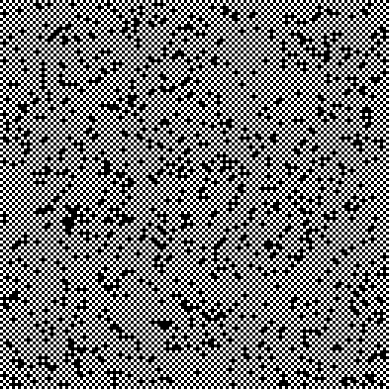
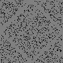
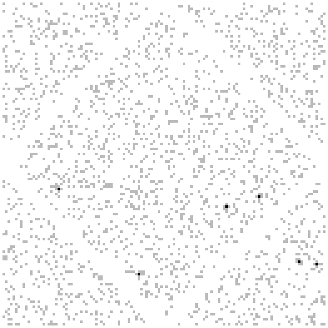
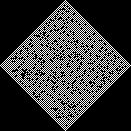
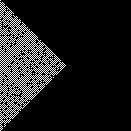
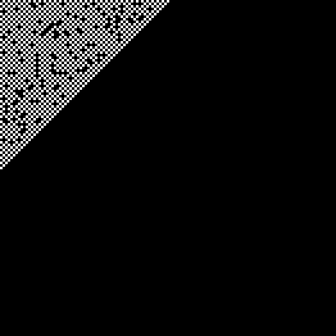

##### Aller au jour : [1](Jour%201) [2](Jour%202) [3](Jour%203) [4](Jour%204) [5](Jour%205) [6](Jour%206) [7](Jour%207) [8](Jour%208) [9](Jour%209) [10](Jour%2010) [11](Jour%2011) [12](Jour%2012) [13](Jour%2013) [14](Jour%2014) [15](Jour%2015) [16](Jour%2016) [17](Jour%2017) [18](Jour%2018) [19](Jour%2019) [20](Jour%2020) 21 [22](Jour%2022) [23](Jour%2023) [24](Jour%2024) [25](Jour%2025) 

# Jour 21

## Partie 1

Un jardinier veut faire un certain nombre de pas dans un jardin :

```no_run
...........
.....###.#.
.###.##..#.
..#.#...#..
....#.#....
.##..S####.
.##..#...#.
.......##..
.##.#.####.
.##..##.##.
...........
```

(Le vrai jardin fait `131x131` cases, et `S` est exactement au milieu aussi).

Il commence en `S`, ne peut pas marcher sur les `#`.

C'est étonnant, l'énoncé décrit pour l'instant un parcours en largeur, au lieu de poser simplement la question de la liste des cases atteignables. Ça m'angoisse un peu à vrai dire.

Mais non, c'est bien ça la question — pour la première partie en tout cas : dans combien de cases différentes le jardinier pourra-t-il se trouver au bout de `64` pas (`6` sur l'exemple) ? La raison de l'explication détaillée du parcours c'est manifestement qu'il faut bien compter exactement `64` pas et pas moins.

Du coup, je ne vais probablement pas réutiliser mon Dijkstra du [jour 17](Jour 17) ?

Bon, ça se passe très vite finalement : trouver les voisins, éliminer les cailloux (et les sorties de terrain), recommencer `n` fois.

Enfin une première partie que je termine vite ! Ça faisait longtemps. Mais du coup je m'inquiète encore un peu plus pour la suite, c'est louche.

```
Parse ← ⊜(≠@#)≠@\n.
Directions ← [0_1 ¯1_0 0_¯1 1_0]

Walk ← (
  ⊙(
    [[.⌊÷2⧻]]. # start in the middle
  )
  ⍥(
    ⊝☇1≡(+Directions ¤) # get neighbors
    ⊃(⬚0⊡|⊙∘)           # check map
    ▽                   # reject rocks and outside cells
  )
  ⊙;
  ⧻
)
PartOne ← (
  ⊙Parse
  Walk
)

$ ...........
$ .....###.#.
$ .###.##..#.
$ ..#.#...#..
$ ....#.#....
$ .##..S####.
$ .##..#...#.
$ .......##..
$ .##.#.####.
$ .##..##.##.
$ ...........
⍤⊃⋅∘≍ 16 PartOne 6
```

## Partie 2

Voyons à quel sauce je vais être mangé…

Et voilà, il ne faut plus faire `64` pas mais `26501365`, c'est pas la même mayonnaise.

Et en plus, la carte se répète à l'infini…

Déjà, j'essaie de lancer mon code de la partie 1 avec un peu plus de `64` étapes. Il me donne des nombres délirants de cases (plus que n'en contient la carte de base), du coup je corrige mon bug qui vient du fait que `pick` avec des coordonnées négatives prend les éléments en fin de liste (du coup `fill``pick` n'est que partiellement intéressant : si on donne un indice au-delà du tableau ça donne bien la valeur par défaut, mais si on donne un indice négatif dont la valeur absolue ne dépasse pas la longueur du tableau, on a l'effet miroir…). Bref je dois vérifier que je n'utilise pas de coordonnées négatives.

Je visualise le résultat et au bout de `129` itérations on arrive à ça (7539 cases atteintes) :



À l'itération suivante (`130` itérations) on a ça (`7546` cases atteintes) :



Et ensuite ça alterne entre ces deux motifs, bien sûr.

Assez logiquement, la carte a été "saturée" et on alterne entre les cases "paires" (atteignable en un nombre pair de cas) et "impaires". Un peu comme un fou qui n'arriverait pas à choisir sa couleur de case…

Attention quand même : toutes les cases "jardin" ne sont pas atteintes. Si je fais le total des cases paires et impaires (`7546 + 7539 = 15085`) il me manque `6` cases pour atteindre le nombre total de cases visitables qui est `15091`.

Voici (en noir) les cases théoriquement visitables qui ne sont jamais atteintes (en gris, les rochers) :



Effectivement, elles sont entièrement entourées de rochers. Le point que je retiens c'est qu'elles sont bien éloignées des bords, et je ne devrais donc pas trop avoir à m'en préoccuper.

En revanche, je note que l'intégralité de la bordure est atteinte. Je remarque qu'à `65` itérations, la "frontière" est exactement la même que s'il n'y avait pas de rochers :



De même, je vérifie visuellement que la bordure se "remplit" uniformément à partir de l'itération `66` jusqu'à l'itération `129`.

Si on considère ça dans le cadre de notre jardin infini parcouru pendant très longtemps, ça veut dire que les mini-jardins voisins du mini-jardin de départ se rempliront exactement comme si le mini-jardin de départ ne contenait pas de rocher : au bout de `64` itérations, le mini-jardin de droite voit apparaître une case visitée sur sa gauche dans la ligne du milieu. Il en verra ensuite d'autres arriver de la gauche, mais je soupçonne que ça ne fasse pas de différence parce que cette première "graine" aura atteint ces cases avant ou en même temps qu'elles seront "colonisées" depuis le mini-jardin de gauche.

Je valide ça visuellement en simulant la marche depuis la case à gauche dans la ligne du milieu :



Quand au mini-jardin situé à droite et en-dessous du mini-jardin de départ, que verra-t-il arriver ? Logiquement, il sera rempli en partant de la case en haut à gauche :



Qu'est-ce que tout ça m'apprend sur le nombre de cases visitées au bout de `26501365` dans un jardin infini ?

Je pense que la "zone" visitée va continuer de s'agrandir uniformémeent et couvrira donc un carré (tourné de 45 degrés) de `26501365*2+1` cases de diagonale. Plus précisément, après `n` pas on couvre… voyons, après `3` itérations on a ça :


Je constate qu'on a dessiné un carré penché de cases blanches, de côté `4`, "englobant" un carré penché de cases noires de côté `3`. En tout on a donc visité `4^2 + 3^2` cases après `3` itérations. Je généralise audacieusement à `(n+1)^2 + n^2` cases visitées après `n` itérations.

Donc, avec nos `26501365` itérations on couvrira `1404644746729181` cases si mes calculs sont bons.

Parmi toutes ces cases potentiellement touchées, la moitié ne le sera pas puisqu'elles auront la mauvaise parité. Mais surtout, la plus grande partie de ces cases appartiendront à des mini-jardins qui seront entièrement inclus dans la zone couverte, et d'après mes observations précédentes je pense pouvoir dire que ces mini-jardins seront "saturés" c'est-à-dire qu'ils contiendront `7539` cases visitées comme je l'ai vu à l'itération `129` (comme le nombre total de pas est impair). Quand aux mini-jardins qui ne sont pas dans ce cas — ceux qui ne sont que partiellement remplis — ils sont dans `8` catégories selon la première case par laquelle ils sont touchés, et ils sont remplis par le nombre d'itérations qui reste après les avoir atteints. Ce nombre restant est probablement différent pour les coins du carré et pour ses diagonales : dans le cas simple du mini-jardin on atteint les bords (qui deviendront les coins) avant d'atteindre les coins (qui deviennent les diagonales).

Il me reste donc à déterminer :
* le nombre de mini-jardins entièrement couverts ;
* le nombre de mini-jardins sur chaque diagonale du carré ;
* le nombre d'itérations qui reste pour les coins du carré et pour ses diagonales ;
* le nombre de cases effectivement visitées dans un mini-jardin pour chacun des `8` cas.

##### Aller au jour : [1](Jour%201) [2](Jour%202) [3](Jour%203) [4](Jour%204) [5](Jour%205) [6](Jour%206) [7](Jour%207) [8](Jour%208) [9](Jour%209) [10](Jour%2010) [11](Jour%2011) [12](Jour%2012) [13](Jour%2013) [14](Jour%2014) [15](Jour%2015) [16](Jour%2016) [17](Jour%2017) [18](Jour%2018) [19](Jour%2019) [20](Jour%2020) 21 [22](Jour%2022) [23](Jour%2023) [24](Jour%2024) [25](Jour%2025) 
