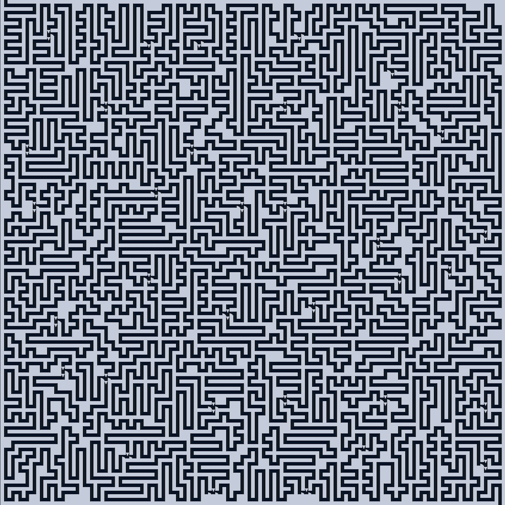
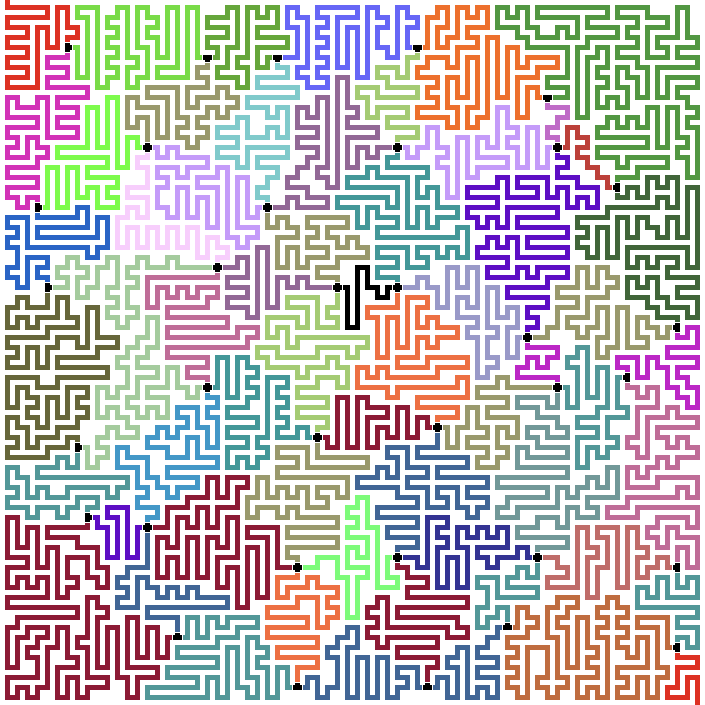
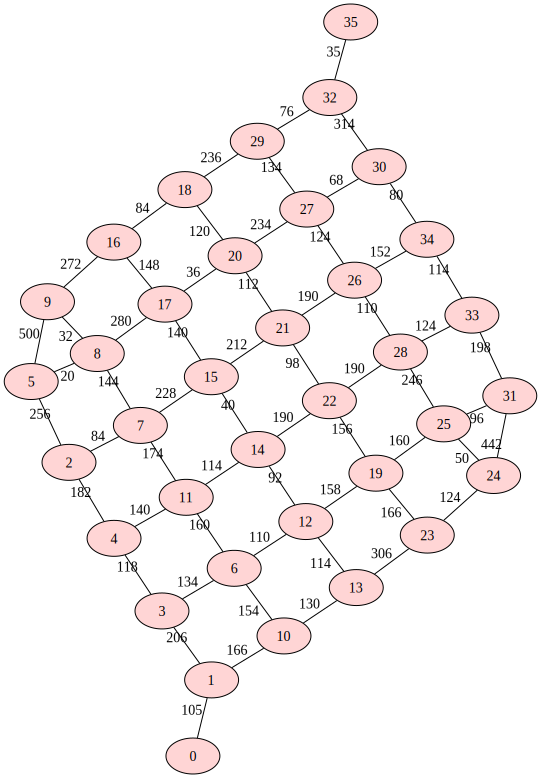

## Partie 1

Encore un labyrinthe :

```no_run
#.#####################
#.......#########...###
#######.#########.#.###
###.....#.>.>.###.#.###
###v#####.#v#.###.#.###
###.>...#.#.#.....#...#
###v###.#.#.#########.#
###...#.#.#.......#...#
#####.#.#.#######.#.###
#.....#.#.#.......#...#
#.#####.#.#.#########v#
#.#...#...#...###...>.#
#.#.#v#######v###.###v#
#...#.>.#...>.>.#.###.#
#####v#.#.###v#.#.###.#
#.....#...#...#.#.#...#
#.#########.###.#.#.###
#...###...#...#...#.###
###.###.#.###v#####v###
#...#...#.#.>.>.#.>.###
#.###.###.#.###.#.#v###
#.....###...###...#...#
#####################.#
```

Le vrai fait `141x141` cases.

Les `#` sont des murs (enfin de la forêt mais bon). Les `>v` (il n'y a pas de `^` ni de `>` !) sont des pentes : quand on arrive sur une de ces cases, il faut que la prochaine étape soit dans le sens du symbole. Comme par ailleurs on n'a pas le droit de visiter la même case deux fois, et que le labyrinthe est manifestement conçu pour n'avoir que des couloirs d'une case de large, ça revient à dire qu'il y a quelques "murs unidirectionnels" qui sont franchissables dans un sens et pas dans l'autre.

La question qui est posée dans cette première partie, c'est celle du chemin le plus _long_ qui existe entre le coin supérieur gauche et le coin inférieur droit.

Je commence par améliorer un peu la lisibilité du labyrinthe, qui se révèle assez contraint :



Je ne sais pas comment on calcule un chemin le plus long dans un graphe (tout ce dont je me souviens, c'est que c'est un exemple de problème qui ne se prête pas à la programmation dynamique parce qu'il ne se décompose pas bien en sous-problèmes), mais Wikipedia pourra sûrement m'aider.

Je me dis cependant déjà qu'il est largement possible de simplifier le graphe de ce labyrinthe. Comme on ne peut pas faire demi-tour, chaque long couloir entre deux embranchements peut être transformé en une seule arête.

Je prends un moment pour colorier à la main les différentes sections du labyrinthe :



Ce qui paraît clair, c'est qu'on a une succession de couloirs qui se terminent sytématiquement par un embranchement menant à deux ou trois autres couloirs.

Tout ce labyrinthe devrait donc pouvoir se réduire à un graphe acyclique orienté (_DAG_) dont chaque nœud porterait la longueur du couloir correspondant. Un parcours dans le labyrinthe reviendrait à sélectionner à chaque niveau un des nœuds. En comptant à la main, le nombre de nœuds par niveau de profondeur serait `1` (le couloir de départ), `2`, `4`, `6`, `8`, `10`, `9`, `8`, `5`, `4`, `2` et `1`. Ce qui me ferait un maximum de `11059200` parcours possibles (certainement moins en réalité car tous les nœuds ne sont pas interconnectés entre deux niveaux). Relativement facile à énumérer exhaustivement. Mais là, on peut utiliser la programmation dynamique : le parcours le plus long en partant de chaque nœud est composé du nombre de pas représenté par ce nœud, plus le parcours le plus long parmi ceux proposés par ses successeurs dans le graphe orienté.

Bon, ce qui me bloque pour écrire du code depuis un moment que je réfléchis, c'est que je ne sais pas quelle structure choisir pour représenter ce graphe orienté en Uiua. Une liste de valeurs des nœud, plus une liste d'arêtes ?

Commençons par le parcours du labyrinthe pour compter les longueurs des couloirs.

Je réalise que les symboles `>` et `v` n'ont aucun impact dans la première moitié du parcours, où un couloir se divise en deux. En revanche dans la deuxième moitié, où les couloirs se rejoignent, ils sont essentiels pour éviter de prendre un couloir à l'envers.

Encore un long tunnel d'implémentation. Après plusieurs faux départs, j'arrive à énumérer les chemins entre les "carrefours". Puis je construis le graphe de ces chemins (sous la forme d'une matrice d'adjacence). Il ne me reste qu'à énumérer les chemins possibles (j'ai laissé tomber la programmation dynamique) dans ce nouveau graphe pour trouver la longueur maximale.

```
Parse ← ⊜∘≠@\n.
Directions ← [0_1 ¯1_0 0_¯1 1_0]
AllowedDirs ← (
  ⊗: ".>v"
  (
    Directions
  | [0_1 0_0 0_0 0_0]
  | [0_0 0_0 0_0 1_0]
  )
)
Step ← (
  # -- continue path grid next
  ⍤"flag should be 1" # drop continue flag
  ⊃(
    ⊢⇌ # last step
    ⊃(
      ⊃(⊡|∘) # look it up in grid
      AllowedDirs
      ⊙¤
      +       # get neighbor coordinates
    | ⍜⊡(⋅@#) # patch grid to avoid backtracking
    )
    ⊃(⬚@#⊡)⊙∘        # look neighbors up in grid
    ▽↥⊃(=@.|=">..v") # keep only walkable
  )∘                 # keep path
  # -- neighbors grid path next
  ⧻. # switch on count of walkable neighbors
  (
    # 0 neighbors: nothing else to do
    # -- neighbors grid path next
    ⊃(⋅⋅⋅⋅0|⋅⋅∘|⋅∘|[])
    # -- continue path grid next
  | # 1 neighbor
    # -- neighbors grid path next
    ⊃(∘|⋅⋅∘|⋅∘|⋅⋅⋅∘) # -- neighbors path grid next
    ⊂:               # add it to path
    1                # continue
  |                  # >1 neighbors
    # -- neighbors grid path next
    ⊃(
      ⊃(⋅⋅⋅⋅0|⋅⋅∘|⋅∘) # -- continue path grid
    | ∘               # next = neighbors
    )
  )
)
# ( start grid -- path next grid' )
WalkFrom ← (
  ¤    # init path with start
  ⊙⊙[] # next to explore
  1    # continue flag
  ⍢Step∘
  ⍤"continue should be 0"=0
  ⊙:
)
SuperStep ← (|3.3
  # -- paths' queue'' grid
  ⊙(
    ⊃(
      ↘1
    | ⊃(⊙⊙; □WalkFrom ⊢|⋅∘)
    ) # process next in queue
  )
  # -- paths queue' path next grid
  ⊃(
    ⊂ ⊙⋅∘  # append path
  | ⊂ ⋅⊙⋅∘ # append next
  )
  # -- paths' queue'' grid'
)
FinalStep ← (
  ⊃(
    # check for empty successorsets
    ±/+⍉.
    ⊙⊙⊙(∩¤)
    ≡(
      # do nothing if empty
      ∩¤:
      ∩□
    |                  # -- successorset length pathmatrix pathlengths
      ⊃(▽⊙⋅⋅∘|▽⊙⋅∘|⊙∘) # get successors lengths and successors
      # -- succlengths succsuccs successorset length pathmatrix pathlengths
      ⊃(+⊙⋅⋅∘|⋅∘) # add its length
      ∩□
      # -- totallengths succsuccs
    )
    :
    # flatten results
    ⊓(°□/⊐⊂|°□/⊐⊂)
  | ⋅⋅⊙∘
  )
)
PartOne ← (
  Parse
  [0_1] # queue
  []    # paths
  # ( paths queue grid -- paths' queue' grid' )
  ⍢(SuperStep|±⋅⧻)
  ⊙;               # drop queue
  ⊝                # remove duplicate paths
  ⊙;               # drop grid
  ≡(⊃(⊡0|⊡¯1|⧻)°□) # keep starts, ends, lengths
  -1°⊚▽+1⇡⧻.       # make matrix of start path ids
  :                # ends startmatrix lengths
  ⊠+:Directions    # get neighbors of path ends
  ⬚¯1⊡             # lookup path neighbors
  ⬚0≡(°⊚▽≥0.)      # build path adjacency matrix
  # -- pathmatrix pathlengths
  # now we just have to walk all paths through this graph
  0            # start path
  ⊃(⊡|⊡⊙;|⋅⊙∘) # get its successors and length
  ∩¤
  ⍢(FinalStep|±⧻⊚)
  # -- successorsets lengths pathmatrix pathlengths
  ⋅⊙⋅; # keep just lengths
  -1   # final fudge
  /↥   # the answer
)

$ #.#####################
$ #.......#########...###
$ #######.#########.#.###
$ ###.....#.>.>.###.#.###
$ ###v#####.#v#.###.#.###
$ ###.>...#.#.#.....#...#
$ ###v###.#.#.#########.#
$ ###...#.#.#.......#...#
$ #####.#.#.#######.#.###
$ #.....#.#.#.......#...#
$ #.#####.#.#.#########v#
$ #.#...#...#...###...>.#
$ #.#.#v#######v###.###v#
$ #...#.>.#...>.>.#.###.#
$ #####v#.#.###v#.#.###.#
$ #.....#...#...#.#.#...#
$ #.#########.###.#.#.###
$ #...###...#...#...#.###
$ ###.###.#.###v#####v###
$ #...#...#.#.>.>.#.>.###
$ #.###.###.#.###.#.#v###
$ #.....###...###...#...#
$ #####################.#
⍤⊃⋅∘≍ 94 PartOne
```

## Partie 2

Comme d'habitude, ça se complique un peu… même question, mais cette fois les contraintes indiquées par `>` et `v` n'existent plus !

Il me faut beaucoup trop de temps pour arriver à modifier mon parcours de carte de la première partie (qui n'était déjà pas brillant) afin d'extraire les distances entre les différents "carrefours". Je finis par y arriver et ça donne un graphe (représenté dans mon programme par une matrice d'adjacence) qui ressemble à ça :



Ensuite il me faut encore beaucoup de temps pour écrire une énumération de tous les chemins possibles qui traversent ce graphe. Heureusement, pas tellement de déboguage une fois que ça tourne. La réponse me parvient en quelques minutes et je suis bien content de pouvoir mettre ce problème derrière moi.

```
Parse ← ⊜∘≠@\n.
Directions ← [0_1 ¯1_0 0_¯1 1_0]
AllowedDirs ← (
  ⊗: ".>v"
  (
    Directions
  | [0_1 1e3_1e3 1e3_1e3 1e3_1e3]
  | [1e3_1e3 1e3_1e3 1e3_1e3 1_0]
  | [1e3_1e3 1e3_1e3 1e3_1e3 1e3_1e3] # you're stuck, man
  )
)
WalkFromStep ← (
  # -- continue path grid next
  ⍤"flag should be 1" # drop continue flag
  ⊃(
    ⊢⇌ # get last step
    ⊃(
      ⊃(⊡|⊙∘) # look it up in grid
      AllowedDirs
      +⊙¤              # get neighbor coordinates
      ⊃(⬚@#⊡|∘)        # look neighbors up in grid
      ▽↥⊃(=@.|=">..v") # keep only walkable
    | ⍜⊡(⋅@#)          # patch grid to avoid backtracking
    )
  )∘ # keep path
  # -- neighbors grid path next
  =1⧻. # switch on count of walkable neighbors
  (
    # -- neighbors grid path next
    ⊃(
      ⊃(⋅⋅⋅⋅0|⋅⋅∘|⋅∘) # -- continue path grid
    | ∘               # next = neighbors
    )
  | # 1 neighbor
    # -- neighbors grid path next
    ⊃(∘|⋅⋅∘|⋅∘|⋅⋅⋅∘) # -- neighbors path grid next
    ⊂:               # add it to path
    1                # continue
  )
)
# ( start grid -- path next grid' )
WalkFrom ← (
  ¤    # init path with start
  ⊙⊙[] # next to explore
  1    # continue flag
  ⍢WalkFromStep∘
  ⍤"continue should be 0"=0
  ⊙:
)

# ( grid -- grid' )
AddBorder ← (
  ⬚∘(↻¯1_¯1↙+2_2△.) @#
)
FindNodes ← (
  ⊃(◫3_3|△) # assumes padded grid
  ≡≡(
    ≠@#
    ↧ ⊃(
      ⊡1_1
    | ≠2 /+ ⊡+1Directions
    )
  )
  ⬚0(↻¯1_¯1↙): # restore border lost by ◫
)
# ( start first grid -- path next grid' )
WalkFromInto ← (
  ⊃(
    ⋅∘
  | ⊙⋅∘
    ⍜⊡(⋅@#) # patch grid to avoid backtracking
  )
  WalkFrom
)

# ( start grid -- lenghts+ends )
PathsFrom ← (
  +Directions¤.
  :
  ¤
  ⊙⊙¤
  ≡(
    ⊓({⊃(⧻|⊢⇌)}|⋅;)WalkFromInto
  )
  ▽>1≡°□⊢⍉. # keep only valid paths
  ⊝
)
MakePathMatrix ← (
  AddBorder
  ⊚FindNodes.
  &p$"nodes: _"/$"_ _".
  # ⊃⊙∘(≡&p⬚0+×2°⊚)
  ⊙(¤)                          # fix grid
  ≡(□≡({⊙⊙∘}⊙°{⊙∘})⊃¤PathsFrom) # build paths
  /⊐⊂                           # flatten results
  ∩∵°□⊟°[⊙:]⍉                   # split into starts/ends + lengths
  ⍉⍜(☇1)⊛                       # number nodes
  ↯:0⊟.⊃(+1/↥♭|⊙∘)              # get node count, make empty matrix
  ⍜(⊡)(⋅∘):                     # fill matrix with lengths
  ⍤"adjacency matrix should be symmetric"≍⍉..
)
RemoveSlopes ← (
  ⍜♭(⍜▽(∵⋅@.) ∊:">v".)
)

StartFrom ← (
  [{⊃(≠:⇡⧻:|⊡|0)}] # initial queue contents
)

UnsetVariants ← (
  ×⊙¤¬⬚0↙⊟:⊃(⧻|⧻.⬚0≡°⊚⊚)
)

# ( {available next lengthsofar} bestlength matrix -- entries )
ProcessQueueEntry ← (
  °{⊙⊙∘}
  # -- available next lengthsofar bestlength matrix
  ⊃∘(
    ×        # filter neighbors by availability
    ×⊃(+|>0) # add lengthsofar to available
  )
  # -- available nextlengths bestlength matrix
  ⊃(
    >0,                            # which neighbors are actually visitable?
    ⊃(UnsetVariants|▽ ⊙⋅⋅⋅∘|▽ ⊙⋅∘) # make queue entries (available' + next + length)
    ≡{⊙⊙∘}                         # pack new queue entries
  | ⊃(
      # compare bestlength to length for final node
      ⋅(⊢⇌)
    | ⋅⋅∘
    | ∘
    )
    >0.
    (
      # final node not reached: nothing to do
      ⋅∘
    | <,,
      (
        # ⊃(&p$"same old:_ <= _\t_"⊙⊙¬)
        ⋅∘
        | ⊃(&p$"new best: _ > _\t_"⊙⊙¬)⊙;
      )
    )
  )
)
# ( queue bestlength matrix -- queue' bestlength' )
FindLongestPathStep ← (|3.2
  ⊃(
    ↘1 # rest of queue
  | ⊢  # pop from queue
    ProcessQueueEntry
  )
  # ⊂ # prepend new queue entries (BFS)
  ⊂: # append new queue entries (DFS)
  # &p⧻.
  # -- queue bestlength matrix
)
FindLongestPath ← (
  StartFrom 0.
  ⊙0 # start with bestlength 0
  ⍢(⊃(FindLongestPathStep|⋅⋅∘)|±⧻)
  ⋅⊙; # drop queue and matrix
)
PartTwo ← (
  Parse

  RemoveSlopes

  MakePathMatrix
  &p⍜now(FindLongestPath)
)

$ #.#####################
$ #.......#########...###
$ #######.#########.#.###
$ ###.....#.>.>.###.#.###
$ ###v#####.#v#.###.#.###
$ ###.>...#.#.#.....#...#
$ ###v###.#.#.#########.#
$ ###...#.#.#.......#...#
$ #####.#.#.#######.#.###
$ #.....#.#.#.......#...#
$ #.#####.#.#.#########v#
$ #.#...#...#...###...>.#
$ #.#.#v#######v###.###v#
$ #...#.>.#...>.>.#.###.#
$ #####v#.#.###v#.#.###.#
$ #.....#...#...#.#.#...#
$ #.#########.###.#.#.###
$ #...###...#...#...#.###
$ ###.###.#.###v#####v###
$ #...#...#.#.>.>.#.>.###
$ #.###.###.#.###.#.#v###
$ #.....###...###...#...#
$ #####################.#
⍤⊃⋅∘≍ 154 PartTwo
```
