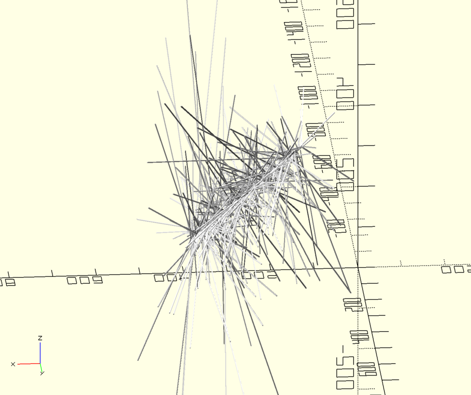
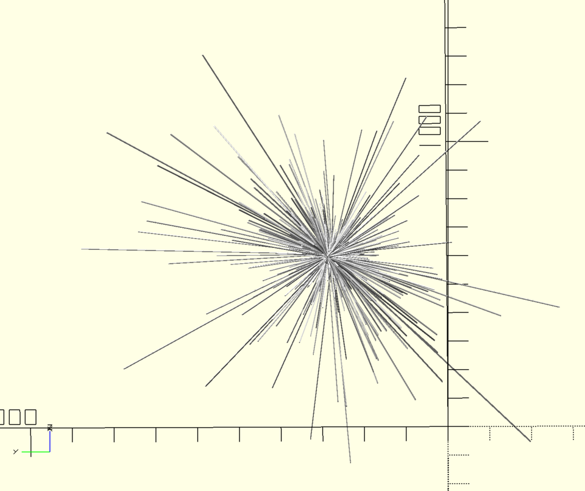
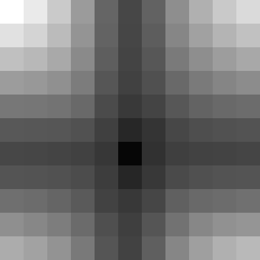

## Partie 1

C'est pas encore tout à fait Noël et pour mériter ses cadeaux, il reste encore un paquet de lignes dont il faut trouver les intersections :

```no_run
19, 13, 30 @ -2,  1, -2
18, 19, 22 @ -1, -1, -2
20, 25, 34 @ -2, -2, -4
12, 31, 28 @ -1, -2, -1
20, 19, 15 @  1, -5, -3
```

Ces droites sont données par un point et un vecteur ; il faut trouver leurs points d'intersection deux à deux (s'ils existent) et vérifier si ces points sont bien dans la direction du vecteur sur chaque droite, et de plus s'ils sont dans une région de l'espace donnée (dans l'exemple, `X` et `Y` entre `7` et `27` ; pour le vrai problème, c'est entre `200000000000000` et `400000000000000`).

Ah, et au moins pour la première partie, on ignore les coordonnées `Z`.

Il y a `300` droites dans l'entrée complète. Avec une approche très naïve, ça me fait `90000` intersections à tester, ça devrait aller.

Tiens, je note qu'il n'y a pas de `0` dans les coordonnées des vecteurs, ça enlève potentiellement des cas pénibles.

L'implémentation se passe assez agréablement, c'est un problème assez "uiuable" comme on dit dans la communauté. Je choisis de calculer le point d'intersection de chaque paire pour ensuite vérifier qu'il est dans la zone et du bon côté de chaque point de départ (pour satisfaire la contrainte que l'intersection potentielle soit "dans le futur"). Je choisis aussi de ne pas optimiser pour éviter de comparer chaque paire deux fois, je divise juste le résultat final par 2. J'utilise `cross` qui est très pratique pour les produits cartésiens comme ça.

Le temps d'exécution est très raisonnable (moins d'une seconde).

```
Parse ← ↯¯1_2_3 ⊜⋕¬∊:", @\n".
StripZ ← ⍜°⍉(↙2)

Cross ← /-×⇌

Intersect ← (
  ∩°⊟ # -- p1 v1 p2 v2
  ⊃(
    Cross ⋅⊙⋅∘ # denom = v1 cross v2
  | Cross -⊙⋅∘ # v2 cross (p2 - p1)
  | :          # v1 p1
  )
  # t = v2 cross (p2 - p1) / denom
  ÷
  # poi = p1 + t*v1
  +×
)

# ( min max [ p1 v1 ] [ p2 v2 ] -- ok )
IntersectOK ← (
  ⊙⊙⊃(Intersect|∩(⊙±°⊟⊢⍉))
  # -- min max poi p1.x sign(v1.x) p2.x sign(v2.x)
  ⊃(
    # poi >= min
    /↧≥⊙⋅∘
  | # poi <= max
    /↧≤⋅⊙∘
  | # sign(poi.x-p1.x) == sign(v1.x)
    ⋅⋅⊙∘
    =±-:⊢
  | # sign(poi.x-p2.x) == sign(v2.x)
    ⋅⋅⊙⋅⋅⊙∘
    =±-:⊢
  )
  ↧∩↧ # and it all
)

PartOne ← (
  ⊃(⋅⋅∘|⊙∘)
  Parse
  StripZ
  ⊠(IntersectOK ⊃(⋅⋅⊙∘|⊙∘)).
  ÷2/+♭
)

$ 19, 13, 30 @ -2,  1, -2
$ 18, 19, 22 @ -1, -1, -2
$ 20, 25, 34 @ -2, -2, -4
$ 12, 31, 28 @ -1, -2, -1
$ 20, 19, 15 @  1, -5, -3
⍤⊃⋅∘≍ 2 PartOne 7 27
```

## Partie 2

Bien sûr, maintenant il faut tenir compte de la troisième dimension.

Et la question est différente : il faut maintenant trouver le point de départ et la vitesse d'une nouvelle particule qui rencontrerait chacune des autres au fil de son parcours.

Je constate assez vite que cela revient à résoudre un système d'équations dont les inconnues sont notamment ce point de départ et ce vecteur vitesse.

En effet, si notre particule `p @ v` rencontre la première particule, notée `p0 @ v0`, c'est qu'il existe un réel `t0` tel que `p0 + t0 * v0 = p + t0 * v`. De même pour `p1 @ v1`, etc.

Chaque particule ajoutée au système introduit une nouvelle inconnue (`t_i`) mais contraint encore plus les valeurs possibles pour `p` et `v `. De fait il me paraît probable que trois ou quatre particules soient suffisantes pour déterminer uniquement `p` et `v`.

Je prends un papier et je me lance dans le développement et la résolution du système à trois, puis quatre équations. Mais ce n'est pas un système linéaire : comme on multiplie parfois deux inconnues entre elles (`t0 * v`, etc.), ce n'est pas un bête [pivot de Gauss](https://fr.wikipedia.org/wiki/Élimination_de_Gauss-Jordan) qui va me sortir de ce traquenard (j'apprendrai par la suite qu'il y avait bien une façon de se ramener à un système linéaire, mais elle m'a complètement échappé).

Je fais quelques recherches sur le web sur le sujet "comment trouver une droite qui croise quatre autre droites". J'apprends que le problème est bien étudié mais qu'il n'a pas une solution simple. Apparemment il faut passer en espace projectif pour trouver une intersection d'hyperboloïdes… gloups.

Je laisse tomber cette approche et je décide de tenter une petite visualisation. Pour ça je sors [OpenSCAD](https://openscad.org) qui en plus de m'être régulièrement utile pour modéliser des pièces à imprimer en 3D, m'a déjà plus d'une fois aidé à visualiser des problèmes au mois de décembre. Ces quelques lignes de Uiua me permettent donc de générer 300 lignes d'OpenSCAD qui dessinent pour chaque particule (en divisant les coordonnées par `1e12` pour rester dans un volume raisonnable) une ligne correspondant au trajet parcouru en un pas (`1e12` pas, du coup) le long de leur vecteur :

```no_run
MakeScad ← (
  ≡(
    ♭
    ⍜(↙3)(×1e-12)
    ≡(□$"__"⊃(⊡:"++-"±|⌵))
    °[⊙⊙⊙⊙⊙∘]
    ∩°□ ⊙⊙∩∩°□
    □$"translate([_,_,_]) hull() { dot(); translate(len*[_,_,_]) dot(); }"
  )
  &fwa "day24.scad"$"module lines() {\n_\n}"/⊐$"_\n_"
)
```

Au début j'obtiens une pelote qui ne ressemble pas à grand-chose :



Mais en pivotant la caméra autour de cet amas, je me rends vite compte que vu sous un certain angle, tout ça commence à prendre forme :



C'est en voyant ces lignes converger que je réalise que le problème revient à trouver un point sur deux de ces droites, tels que la droite qui passe par ces deux points croise toutes les autres droites. Comme on a de plus la contrainte que les points d'intersection sont toujours à un nombre positif de "pas" dans la direction du vecteur directeur de chaque droite, cela veut dire que je peux sélectionner deux droites et chercher les deux nombres positifs qui donnent (en marchant le long de chaque droite sélectionnée) les deux points par lesquels passe la droite recherchée.

Ce qui est intéressant aussi, c'est que j'ai un moyen d'évaluer si la droite donnée par une paire de points est proche de la solution. En effet, la formule qui calcule le point d'intersection de deux droites dans l'espace s'il existe, peut aussi donner la distance de plus courte approche de ces deux droites quand elles ne se croisent pas. Avec ça, je peux probablement évaluer si une droite proposée est plus ou moins proche de l'axe recherché, par exemple en calculant la distance de ma droite candidate à chacune des trajectoires de particules et en retenant leur somme ou simplement le maximum. Cette valeur devrait s'approcher de zéro au fur et à mesure que j'améliorerai mon estimation des points par lesquels va passer la droite finale.

Je choisis donc à l'œil deux droites (parmi les 300) qui me semblent "sympathiques" : plutôt perpendiculaires à l'axe apparent, et avec des vecteurs de longueur similaire. Je choisis un intervalle initial de `0` à `1e12` pour la valeur du nombre de pas (`t1` et `t2`) à faire sur chacune de ces droites. Puis j'écris une boucle qui subdivise cet intervalle en `10` valeurs possibles de `t1` et autant pour `t2`, et j'évalue ma fonction à optimiser (le maximum de la distance aux autres droites) sur ces `100` paires de valeurs.

Ça me génère une matrice de valeurs que je peux visualiser, avec du noir pour la valeur minimale et du blanc pour la valeur maximale :



Je peux ensuite choisir la cellule correspondant à la valeur minimale, et "zoomer" en divisant par 10 la taille de l'intervalle. En répétant cette opération jusqu'à ce que l'intervalle soit suffisamment petit, j'arrive à converger vers des valeurs pour `t1` et `t2` qui génèrent la droite recherchée.

Il me suffit pour finir d'en déduire les valeurs du point de départ et du vecteur directeur pour la trajectoire de la nouvelle particule. Ça me prend plusieurs essais parce que je m'embrouille dans la conversion d'expressions mathématiques simples en code Uiua.

À la fin, je constate que la sélection des deux droites sur lesquelles on cherche les points n'a pas d'impact donc je simplifie en prenant simplement les deux premières ; en revanche, je n'arrive pas à faire fonctionner rapidement mon code de recherche de solution sur l'exemple (les ordres de grandeur ne sont pas du tout les mêmes, il faudrait probablement ajuster l'intervalle de départ) et je décide que ce n'est pas bien grave.

```
Parse ← ↯¯1_2_3 ⊜⋕¬∊:", @\n".

CrossThree ← (
  # [ x1 y1 z1 ] [x2 y2 z2]
  -⊃(
    ↻1 # [ y1 z1 x1 ] [x2 y2 z2]
    ×  # [ y1x2 z1y2 x1z2 ]
    ↻1 # [ z1y2 x1z2 y1x2 ]
  | ↻2 # [ z1 x1 y1 ] [x2 y2 z2]
    ×  # [ z1x2 x1y2 y1z2 ]
    ↻2 # [ y1z2 z1x2 x1y2 ]
  )
  # [ y1z2-z1y2 z1x2-x1z2 x1y2-y1x2 ]
)

DotThree ← (
  /+×
)

NormThree ← (
  ⍜(°√)/+
)

NormalizeThree ← (
  ÷ NormThree.
)

# ( [ p1 v1 ] [ p2 v2 ] -- distance )
LineSeparation ← (
  ∩°⊟ # -- p1 v1 p2 v2
  ⊃(
    -:⊙⋅∘                          # p1 - p2
  | NormalizeThree CrossThree ⋅⊙⋅∘ # n = normalized(v1 cross v2)
  )
  ⌵DotThree
)

# size center
MakeRangeTable ← (
  ⊠⊟°⊟⍉+⍉פ÷10-5⇡10 ⊙¤
)

# ( t l -- p )
PointOnLine ← (
  ⊙(°⊟⇌) # t v p
  +×
)

# [ t1 t2 ] l1 l2 lines
TryPair ← (
  °⊟ # t1 t2
  ⊙: # t1 l1 t2 l2
  ∩PointOnLine
  # -- pi1=t1*v1+p1 pi2=t2*v2+p2
  ⊃(∘|-)
  # -- pi1 pi2-pi1
  ⊟
  # [ pi vi ]
  ¤
  /↥≡LineSeparation
)

# [[[t1 t2]*]*]
ScanRange ← (
  ⍜(☇1)(
    ≡TryPair
  )
)

Step ← (
  # rangesize rangecenter data
  ⊃(
    ∘ # keep rangesize
  | MakeRangeTable
    ⊃(
      ScanRange
      # &p ↙3 ⊏⍏.♭. # ⍜(×1e12)⁅
      # &ims ÷/↥♭..
      &p$"worst=_ best=_"⊃(/↥|/↧)♭.
      ⊢⍏♭ # min cell index
    | ☇1  # as pair list
    )
    ⊡ # pick best pair as new center
    &p$"best pair=_".
  | ⋅⋅⊙⊙∘ # keep data
  )
  # rangesize rangecenter data
)

Solve ← (
  # pick two stones
  °⊟↙ 2.
  ¤⊙∩¤ # fix stones and list
  # start with a range
  ⊟. 1e13 [0 0]
  ⍢(
    # &p$"_ _",,
    Step
    ×0.5
  | >1/↧
  )
  ; # drop range size
  ⁅ # round t1 t2 to ints
  &p$"t1=_ t2=_"°⊟.
  ⊙⊙⊙;
  # [ t1 t2 ] l1 l2
  ⊙(&p$"l1=\n_\nl2=\n_\n",,)
  ⊙⊙(∩(°⊟⊢))°⊟
  &p$"p1=_\nv1=_\np2=_\nv2=_"⊃(⋅⋅⊙⊙⊙∘|⊙⊙⊙⊙⊙∘)
  ∩+⊃(×⊙⋅⋅∘|⋅⋅∘|×⋅⊙⋅⋅⋅∘|⋅⋅⋅⋅∘|⊙∘)
  # pi1 pi2 t1 t2
  &p$"pi1=_\npi2=_",,
  ⊃(
    ÷:∩- # v = (pi2-pi1)/(t2-t1)
    &p$"v=_".
  | ⋅⋅∘ # t1
  | ∘   # pi2
  )
  -× # p = pi1 - t1*v
  &p$"p=_".
  /+
)
PartTwo ← (
  Parse
  Solve
)
```

##### Aller au jour : [1](Jour%201) [2](Jour%202) [3](Jour%203) [4](Jour%204) [5](Jour%205) [6](Jour%206) [7](Jour%207) [8](Jour%208) [9](Jour%209) [10](Jour%2010) [11](Jour%2011) [12](Jour%2012) [13](Jour%2013) [14](Jour%2014) [15](Jour%2015) [16](Jour%2016) [17](Jour%2017) [18](Jour%2018) [19](Jour%2019) [20](Jour%2020) [21](Jour%2021) [22](Jour%2022) [23](Jour%2023) 24 [25](Jour%2025) 
