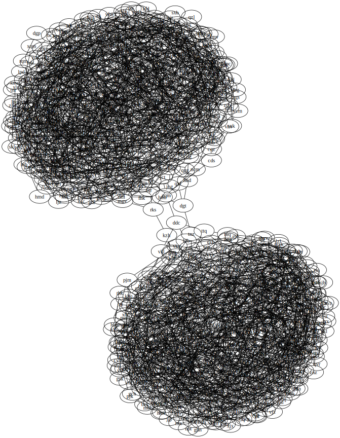

##### Aller au jour : [1](Jour%201) [2](Jour%202) [3](Jour%203) [4](Jour%204) [5](Jour%205) [6](Jour%206) [7](Jour%207) [8](Jour%208) [9](Jour%209) [10](Jour%2010) [11](Jour%2011) [12](Jour%2012) [13](Jour%2013) [14](Jour%2014) [15](Jour%2015) [16](Jour%2016) [17](Jour%2017) [18](Jour%2018) [19](Jour%2019) [20](Jour%2020) [21](Jour%2021) [22](Jour%2022) [23](Jour%2023) [24](Jour%2024) 25 

# Jour 25

## Partie 1 (il n'y a pas de partie 2)

Le bout du tunnel ! Pour ce dernier problème on nous donne une fois de plus un graphe :

```no_run
jqt: rhn xhk nvd
rsh: frs pzl lsr
xhk: hfx
cmg: qnr nvd lhk bvb
rhn: xhk bvb hfx
bvb: xhk hfx
pzl: lsr hfx nvd
qnr: nvd
ntq: jqt hfx bvb xhk
nvd: lhk
lsr: lhk
rzs: qnr cmg lsr rsh
frs: qnr lhk lsr
```

Et la question est simple : quels sont les trois arêtes qu'on peut supprimer de ce graphe pour le séparer en deux parties ? Ou plutôt, une fois ces trois arêtes coupées, quel est le produit des nombres de nœuds de ces deux parties ?

Bon, comme d'habitude, on commence par visualiser. Confession : j'ai écrit la conversion de l'entrée en un fichier au format Graphviz avec `awk` (ça donne `< day25.txt awk -F'(: | )' 'BEGIN{print "graph {"}{for(i=2;i<=NF;i++) printf("\"%s\" -- \"%s\"\n", $1, $i)}END{print "}"}'`) pour gagner du temps. Mais pour respecter l'esprit de ce blog, voici une version Uiua écrite plus tard :

```
Parse ← ⊜(⊟⊙□⊃(⊢|≡°□↘1)⊜□¬∊:": ".) ≠@\n.

MakeDot ← (
  ≡(
    °{⊙∘}
    ¤
    ≡(
      $"  \"_\" -- \"_\""
    )
    /$"_\n_"
    □
  )
  $"graph {\n_\n}"/($"_\n_"∩°□)
)

$ jqt: rhn xhk nvd
$ rsh: frs pzl lsr
$ xhk: hfx
$ cmg: qnr nvd lhk bvb
$ rhn: xhk bvb hfx
$ bvb: xhk hfx
$ pzl: lsr hfx nvd
$ qnr: nvd
$ ntq: jqt hfx bvb xhk
$ nvd: lhk
$ lsr: lhk
$ rzs: qnr cmg lsr rsh
$ frs: qnr lhk lsr

&p MakeDot Parse
```

Voilà à quoi ça ressemble après être passé par `neato` :



Bon, je crois que la solution est évidente. En tout cas, pour ce qui est de la sélection des arêtes.

Il reste à compter les nœuds dans chacune de ces "pelotes". J'en connais qui l'ont fait dans Inkscape ; je me dis au début que je vais coder ça vite fait en Uiua mais je décide finalement d'utiliser un des utilitaires inclus avec Graphviz, qui permet de compter le nombre de nœuds par composante d'un graphe déconnecté.

```no_run
$ < day25.dot egrep -v '"rks" -- "kzh"|"kzh" -- "rks"|"gqm" -- "ddc"|"ddc" -- "gqm"|"dgt" -- "tnz"|"tnz" -- "dgt"'| ccomps -vs
(   0)     708 nodes    1584 edges
(   1)     735 nodes    1636 edges
          1443 nodes    3220 edges       2 components %1
```

Et voilà, plus qu'à multiplier ces deux nombres pour obtenir la réponse demandée.

J'ai un petit regret de ne pas avoir été jusqu'à implémenter [l'algorithme de Karger](https://en.wikipedia.org/wiki/Karger%27s_algorithm) pour identifier les arêtes à couper. Mais je m'accorde ce succès facile pour ce dernier jour du calendrier.

##### Aller au jour : [1](Jour%201) [2](Jour%202) [3](Jour%203) [4](Jour%204) [5](Jour%205) [6](Jour%206) [7](Jour%207) [8](Jour%208) [9](Jour%209) [10](Jour%2010) [11](Jour%2011) [12](Jour%2012) [13](Jour%2013) [14](Jour%2014) [15](Jour%2015) [16](Jour%2016) [17](Jour%2017) [18](Jour%2018) [19](Jour%2019) [20](Jour%2020) [21](Jour%2021) [22](Jour%2022) [23](Jour%2023) [24](Jour%2024) 25 
